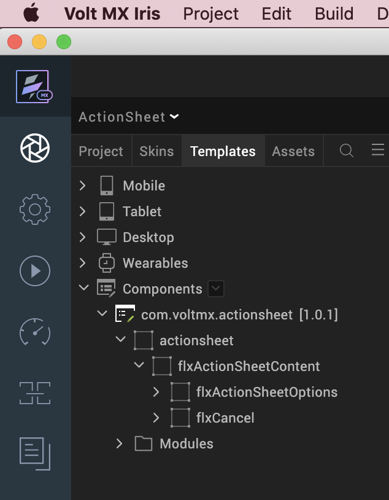

# ACTION SHEET (1.0.1)

## 1.Overview

An Action Sheet is a popover which presents user with a set of actions out of
which one may be chosen.

### A.Use case

Consider that you are developing a Restaurant Locator app which displays a list
of restaurants that are located near the current location. In this app, you can
add the Action Sheet component. When a user selects the Get Directions option
for a restaurant, an action sheet appears with a list of map services. The user
can select a service and get the desired output.

### B.Percentage of re-use:

90%

### C.Features

-   Initiate your app tasks

-   Add upto 8 actions

-   Facility to customize the UI elements

## 2.Getting Started

### A.Prerequisite

Before you start using the Action Sheet component, ensure the following:

• [HCL Foundry](https://manage.hclvoltmx.com/)

• Volt MX Iris

### B.Platforms Supported

i.Mobile

	1.iOS

	2.Android

ii.Tablets

iii. PWA

### C. Importing the app

 You can import the Forge components only into the apps that are of the Reference Architecture type.

### **To import the Action Sheet component, do the following:**

1. Open your app project in Volt MX Iris.

2. In the Project Explorer, click the **Templates** tab.

3. Right-click **Components**, and then select **Import Component**. The **Import
Component** dialog box appears.

4. Click **Browse** to navigate to the location of the component, select the
component, and then click **Import**. The component and its associated widgets
and modules are added to your project.

## 

Once you have imported a component to your project, you can easily add the
component to a form. For more information, refer Add a Component to a Form

## D.Building and previewing the app

After performing all the above steps, you can build your app and run it on your
device. For more information, you can refer to the [Building and Viewing an
Application](https://opensource.hcltechsw.com/volt-mx-docs/docs/documentation/Iris/iris_user_guide/Content/Cloud_Build_in_VoltMX_Iris.html#cloud)
section of the Volt MX User Guide.

You can then run your app to see the Action Sheet work in real time.

## 3.References

### A.Dynamic Usage

You can also add **Action Sheet** component dynamically. To do so,

1\. In the **Project Explorer**, on the **Projects** tab, click **Controllers**
section to access the respective **Form Controller**. Create a method and
implement the code snippet similar to the sample code mentioned below.

	/\* Creating Action Sheet component instance \*/

	var actionSheet= new com.voltmx.actionsheet(

	{

	id: "actionsheet",

	isVisible: true,

	height: "100%",

	top: "0dp",

	left: "0dp",

	width: "100%",

	layoutType: voltmx.flex.FREE_FORM,

	autogrowMode: voltmx.flex.AUTOGROW_NONE,

	skin: "voltmxsknFlx",

	clipBounds:true,

	zIndex:1

	}, {}, {});

	/\*Setting the component's properties\*/

	actionSheet.headerMainText = "Get Directions";

	actionSheet.headerSubText= "Which app do you want to use?";

	actionSheet.option1Text = "Use Map 1";

	actionSheet.option2Text = "Use Map 2";

	actionSheet.option3Text = "Use Map 3";

	actionSheet.option4Text = "Use Map 4";

	actionSheet.option5Text = "Use Map 5";

	actionSheet.option6Text = "Use Map 6";

	actionSheet.option7Text = "Use Map 7";

	actionSheet.option8Text = "Use Map 8";

	/\*Adding the Action Sheet component to a Form\*/

	this.view.add(actionSheet);
	
	}

In the code snippet, you can edit the properties of the component as per your
requirement. For more information, see Setting Properties.

2\. Save the file

**General Properties**

**i. Header**

**1\. Main Text (headerMainText)**

| <!-- -->         | <!-- -->                                                  |
|------------------|-----------------------------------------------------------|
| **Description:** | Specifies the text to be displayed as the main header.    |
| Syntax:          | headerMainText                                            |
| **Type:**        | String                                                    |
| **Read/Write:**  | Read + Write                                              |
| **Example:**     | this. view. actionsheet.headerMainText= "Get Directions"; |
| **Remarks:**     | The default value for the property is “Get Directions”.   |

**2\. Sub Text (headerSubText)**

| <!-- -->         | <!-- -->                                                  |
|------------------|-----------------------------------------------------------|
| **Description:** | Specifies the text to be displayed as the sub header.                   |
| Syntax:          | headerSubText                                                           |
| **Type:**        | String                                                                  |
| **Read/Write:**  | Read + Write                                                            |
| **Example:**     | this. view. actionsheet.headerSubText= "Which app do you want to use?"; |
| **Remarks:**     | The default value for the property is “Which app do you want to use?”.  |

**ii\. Options**

**3\. Option1 Text (option1Text)**

| <!-- -->         | <!-- -->                                                  |
|------------------|-----------------------------------------------------------|
| **Description:** | Specifies the text to be displayed as the option 1.       |
| Syntax:          | option1Text                                               |
| **Type:**        | String                                                    |
| **Read/Write:**  | Read + Write                                              |
| **Example:**     | this. view. actionsheet. option1Text = "Use Google Maps"; |
| **Remarks:**     | The default value for the property is “Use Google Maps”.  |

**4\. Option2 Text (option2Text)**

| <!-- -->         | <!-- -->                                                  |
|------------------|-----------------------------------------------------------|
| **Description:** | Specifies the text to be displayed as the option 2.      |
| Syntax:          | option2Text                                              |
| **Type:**        | String                                                   |
| **Read/Write:**  | Read + Write                                             |
| **Example:**     | this. view. actionsheet. option2Text = "Use Apple Maps"; |
| **Remarks:**     | The default value for the property is “Use Apple Maps”.  |

**5\. Option3 Text (option3Text)**

| <!-- -->         | <!-- -->                                                  |
|------------------|-----------------------------------------------------------|
| **Description:** | Specifies the text to be displayed as the option 3.      |
| Syntax:          | option3Text                                              |
| **Type:**        | String                                                   |
| **Read/Write:**  | Read + Write                                             |
| **Example:**     | this. view. actionsheet. option3Text = "Use CityMapper"; |
| **Remarks:**     | The default value for the property is “Use CityMapper”.  |

**6\. Option4 Text (option4Text)**

| <!-- -->         | <!-- -->                                                  |
|------------------|-----------------------------------------------------------|
| **Description:** | Specifies the text to be displayed as the option 4.                       |
| Syntax:          | option4Text                                                               |
| **Type:**        | String                                                                    |
| **Read/Write:**  | Read + Write                                                              |
| **Example:**     | this. view. actionsheet. option4Text = "Use Map 4";                       |
| **Remarks:**     | The component will not display the option if you do not provide any text. |

**7\. Option5 Text (option5Text)**

| <!-- -->         | <!-- -->                                                  |
|------------------|-----------------------------------------------------------|
| **Description:** | Specifies the text to be displayed as the option 5.                       |
| Syntax:          | option5Text                                                               |
| **Type:**        | String                                                                    |
| **Read/Write:**  | Read + Write                                                              |
| **Example:**     | this. view. actionsheet.option5Text= "Use Map 5";                         |
| **Remarks:**     | The component will not display the option if you do not provide any text. |

**8\. Option6 Text (option6Text)**

| <!-- -->         | <!-- -->                                                  |
|------------------|-----------------------------------------------------------|
| **Description:** | Specifies the text to be displayed as the option 6                        |
| Syntax:          | option6Text                                                               |
| **Type:**        | String                                                                    |
| **Read/Write:**  | Read + Write                                                              |
| **Example:**     | this. view. actionsheet. option6Text = "Use Map 6";                       |
| **Remarks:**     | The component will not display the option if you do not provide any text. |

**9\. Option7 Text (option7Text)**

| <!-- -->         | <!-- -->                                                  |
|------------------|-----------------------------------------------------------|
| **Description:** | Specifies the text to be displayed as the option 7.                       |
| Syntax:          | option7Text                                                               |
| **Type:**        | String                                                                    |
| **Read/Write:**  | Read + Write                                                              |
| **Example:**     | this. view. actionsheet. option7Text = "Use Map 7";                       |
| **Remarks:**     | The component will not display the option if you do not provide any text. |

**10\. Option8 Text (option8Text)**

| <!-- -->         | <!-- -->                                                  |
|------------------|-----------------------------------------------------------|
| **Description:** | Specifies the text to be displayed as the option8.                        |
| Syntax:          | option8Text                                                               |
| **Type:**        | String                                                                    |
| **Read/Write:**  | Read + Write                                                              |
| **Example:**     | this. view. actionsheet.option8Text= "Use Map 8";                         |
| **Remarks:**     | The component will not display the option if you do not provide any text. |

**iii. Footer**

**11\. Close Text (closeText)**

| <!-- -->         | <!-- -->                                                  |
|------------------|-----------------------------------------------------------|
| **Description:** | Specifies the text to be displayed as the closing option. |
| Syntax:          | closeText                                                 |
| **Type:**        | String                                                    |
| **Read/Write:**  | Read + Write                                              |
| **Example:**     | this. view. actionsheet. closeText= "Cancel";             |
| **Remarks:**     | The default value for the property is “Cancel”.           |

## **Skins Section**

**i. Header**

**12\. Sheet Background Skin (sheetBackgroundSkin)**

| <!-- -->         | <!-- -->                                                  |
|------------------|-----------------------------------------------------------|
| **Description:** | Specifies the skin that is applied to the background container of Header and Options. |
| Syntax:          | sheetBackgroundSkin                                                                   |
| **Type:**        | String                                                                                |
| **Read/Write:**  | Read + Write                                                                          |
| **Example:**     | this. view. actionsheet. sheetBackgroundSkin = "voltmxsknFlxFFFFFFBGRounded10";       |
| **Remarks:**     | The default value for the property is “voltmxsknFlxFFFFFFBGRounded10”.                |

**13\. Header Main Text Skin (headerMainTextSkin)**

| <!-- -->         | <!-- -->                                                  |
|------------------|-----------------------------------------------------------|
| **Description:** | Specifies the skin that is applied to the header main text.    |
| Syntax:          | headerMainTextSkin                                             |
| **Type:**        | String                                                         |
| **Read/Write:**  | Read + Write                                                   |
| **Example:**     | this. view. actionsheet. headerMainTextSkin = "voltmxsknLbl1"; |
| **Remarks:**     | The default value for the property is “voltmxsknLbl1”.         |

**14\. Header Sub Text Skin (headerSubTextSkin)**

| <!-- -->         | <!-- -->                                                  |
|------------------|-----------------------------------------------------------|
| **Description:** | Specifies the skin that is applied to the header sub text.   |
| Syntax:          | headerSubTextSkin                                            |
| **Type:**        | String                                                       |
| **Read/Write:**  | Read + Write                                                 |
| **Example:**     | this. view. actionsheet. headerSubTextSkin = "voltmxsknLbl"; |
| **Remarks:**     | The default value for the property is “voltmxsknLbl”.        |

**15\. Seperator Skin (separatorSkin)**

| <!-- -->         | <!-- -->                                                  |
|------------------|-----------------------------------------------------------|
| **Description:** | Specifies the skin that is applied to the separator line.          |
| Syntax:          | separatorSkin                                                      |
| **Type:**        | String                                                             |
| **Read/Write:**  | Read + Write                                                       |
| **Example:**     | this. view. actionsheet. separatorSkin = "voltmxsknFlxCCCCCCBGOp"; |
| **Remarks:**     | The default value for the property is “voltmxsknFlxCCCCCCBGOp”.    |

## **2. Options Skin**

**16\. Options Skin (optionsSkin)**

| <!-- -->         | <!-- -->                                                  |
|------------------|-----------------------------------------------------------|
| **Description:** | Specifies the skin to be applied to the options in the actionsheet. |
| Syntax:          | optionsSkin                                                         |
| **Type:**        | String                                                              |
| **Read/Write:**  | Read + Write                                                        |
| **Example:**     | this. view. actionsheet. optionsSkin = "voltmxsknBtn1";             |
| **Remarks:**     | The default value for the property is “voltmxsknBtn1”.              |

**17\. Options Focus Skin (optionsFocusSkin)**

| <!-- -->         | <!-- -->                                                  |
|------------------|-----------------------------------------------------------|
| **Description:** | Specifies the skin to be applied to the options in the actionsheet when it is focused. |
| Syntax:          | optionsFocusSkin                                                                       |
| **Type:**        | String                                                                                 |
| **Read/Write:**  | Read + Write                                                                           |
| **Example:**     | this. view. actionsheet. optionsFocusSkin = "voltmxsknBtnFAFAFABG1";                   |
| **Remarks:**     | The default value for the property is “voltmxsknBtnFAFAFABG1”.                         |

## **3\. Footer**

**18\. Footer Background Skin (footerBackgroundSkin)**

| <!-- -->         | <!-- -->                                                  |
|------------------|-----------------------------------------------------------|
| **Description:** | Specifies the skin to be applied to the background container of the footer.    |
| Syntax:          | footerBackgroundSkin                                                           |
| **Type:**        | String                                                                         |
| **Read/Write:**  | Read + Write                                                                   |
| **Example:**     | this. view. actionsheet. footerBackgroundSkin = "voltmxsknFlxFFFFFFBGRounded"; |
| **Remarks:**     | The default value for the property is “voltmxsknFlxFFFFFFBGRounded”.           |

**19\. Footer Button Skin (footerButtonSkin)**

| <!-- -->         | <!-- -->                                                  |
|------------------|-----------------------------------------------------------|
| **Description:** | Specifies the skin to be applied to the footer button.      |
| Syntax:          | footerButtonSkin                                            |
| **Type:**        | String                                                      |
| **Read/Write:**  | Read + Write                                                |
| **Example:**     | this. view. actionsheet. footerButtonSkin = "voltmxsknBtn"; |
| **Remarks:**     | The default value for the property is “voltmxsknBtn”.       |

**20\. Footer Button Focus Skin (footerButtonFocusSkin)**

| <!-- -->         | <!-- -->                                                  |
|------------------|-----------------------------------------------------------|
| **Description:** | Specifies the skin to be applied to the footer button when it is focused. |
| Syntax:          | footerButtonFocusSkin                                                     |
| **Type:**        | String                                                                    |
| **Read/Write:**  | Read + Write                                                              |
| **Example:**     | this. view. actionsheet. footerButtonFocusSkin= "voltmxsknBtnFAFAFABG";   |
| **Remarks:**     | The default value for the property is “voltmxsknBtnFAFAFABG”.             |

## C.API’s

### **i. show**

| <!-- -->         | <!-- -->                          |
|------------------|-----------------------------------|
|  **Description:**  | The API displays the actionsheet. |
|  Syntax:           | show ()                           |
|  **Parameters:**   | None                              |
|  **Return Value:** | None                              |
|  **Example:**      | this. view. actionsheet. show (); |

### **ii. dismiss**
| <!-- -->         | <!-- -->                          |
|------------------|-----------------------------------|
| **Description:**  | The API dismisses the actionsheet.   |
| Syntax:           | dismiss ()                           |
| **Parameter:**    | None                                 |
| **Return Value:** | None                                 |
| **Example:**      | this. view. actionsheet. dismiss (); |

## D. Events

 

### **1. onClickOption1**

| <!-- -->         | <!-- -->                          |
|------------------|-----------------------------------|
| **Description:** | The event is invoked when a user clicks option 1.                                     |
| Syntax:          | onClickOption1()                                                                      |
| **Example:**     | this. view. actionsheet. onClickOption1= function ()  {   alert (“Clicked Option 1”);  }; |

### **2. onClickOption2**

| <!-- -->         | <!-- -->                          |
|------------------|-----------------------------------|
| **Description:** | The event is invoked when a user clicks option 2.                                     |
| Syntax:          | onClickOption2()                                                                      |
| **Example:**     | this. view. actionsheet. onClickOption2= function ()   {   alert (“Clicked Option 2”);   }; |

### **3. onClickOption3**

| <!-- -->         | <!-- -->                          |
|------------------|-----------------------------------|
| **Description:** | The event is invoked when a user clicks option 3.                                     |
| Syntax:          | onClickOption3()                                                                      |
| **Example:**     | this. view. actionsheet. onClickOption3= function ()   {   alert (“Clicked Option 3”);   }; |

### **4. onClickOption4**

| <!-- -->         | <!-- -->                          |
|------------------|-----------------------------------|
| **Description:** | The event is invoked when a user clicks option 4.                                     |
| Syntax:          | onClickOption4()                                                                      |
| **Example:**     | this. view. actionsheet. onClickOption4= function ()   {   alert (“Clicked Option 4”);   }; |

### **5. onClickOption5**

| <!-- -->         | <!-- -->                          |
|------------------|-----------------------------------|
| **Description:** | The event is invoked when a user clicks option 5.                                     |
| Syntax:          | onClickOption5()                                                                      |
| **Example:**     | this. view. actionsheet. onClickOption5= function ()   {   alert (“Clicked Option 5”);   }; |

### **6. onClickOption6**

| <!-- -->         | <!-- -->                          |
|------------------|-----------------------------------|
| **Description:** | The event is invoked when a user clic
| **Description:** | The event is invoked when a user clicks option 6.                                     |
| Syntax:          | onClickOption6()                                                                      |
| **Example:**     | this. view. actionsheet. onClickOption6= function ()   {   alert (“Clicked Option 6”);   }; |

### **7. onClickOption7**

| <!-- -->         | <!-- -->                          |
|------------------|-----------------------------------|
| **Description:** | The event is invoked when a user clicks option 7.                                     |
| Syntax:          | onClickOption7()                                                                      |
| **Example:**     | this. view. actionsheet. onClickOption7= function ()   {   alert (“Clicked Option 7”);   }; |

### **8. onClickOption8**

| <!-- -->         | <!-- -->                          |
|------------------|-----------------------------------|
| **Description:** | The event is invoked when a user clicks option 8.                                       |
| Syntax:          | onClickOption8()                                                                        |
| **Example:**     | this. view. actionsheet. onClickOption8= function ()   {   alert (“Clicked Option 8”);   };   |

### **9. onClose**

| <!-- -->         | <!-- -->                          |
|------------------|-----------------------------------|
| **Description:** | The event is invoked when user clicks Cancel button.                                |
| Syntax:          | onClose ()                                                                          |
| **Example:**     | this. view. actionsheet. onClose= function ()   {   alert (“Clicked Cancel button”);   }; |
 

## 4. Revision History

App version 1.0.1:

### A.Limitations

1\. Landscape mode is not supported.

2\. If browser height is minimized UI gets distorted.

