# AUGMENTED REALITY(NATIVE) SAMPLE APPLICATION (1.0.1)

## **Details**

## Overview

Augmented Reality is changing the way real world information is augmented with
virtual 3D content that enables delivering rich and amazing experiences to the
users. AR also simultaneously provides a great degree of information. This
enables rendering of real world information and presenting it in an interactive
way, where virtual elements can become part of the real world, extending the
real world into virtual world.

With capabilities ranging from Real-time Image Recognition and Tracking,
SLAM(Simultaneous localization and Mapping) and virtual 3D Models in AR scenes
that enables you in creating powerful interfaces and rich feedback loops in
products customization. This revolutionizes the way rich content can be
delivered.

This application is based on ARRenderer widget. The widget is added dynamically
to the form and is used for scanning surfaces and adding objects.

-   **Supported Platforms**

    -   Native iOS and Android - Using ARRenderer widget

    -   iPhone, Android Phone, iPad, Android tablet

**Notes** :

1.  Volt MX Iris v 9.2.3

2.  XCode v 11.3 , iOS v 13.0

3.  Android v 7.0

## **How To:**

## 1. **Getting Started with AR SAMPLE APPLICATION**

**Select the AR project**

Open VoltMX Iris. From menu bar click on Project -\> New Project. You can see
the below screen. Click on Sample Apps and then click Next button.

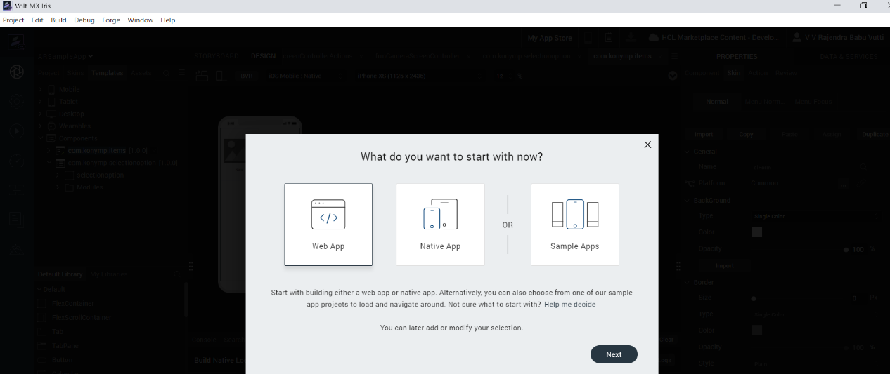

Select Augmented Reality App and then click on Choose button.

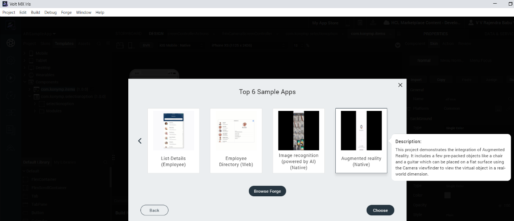

From the **Project** explorer, go to **Mobile**, expand **Forms**, and then
verify whether the **frmDashboard, frmCameraScreen** is successfully imported to
the existing application

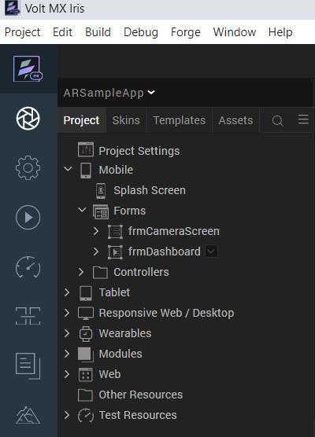

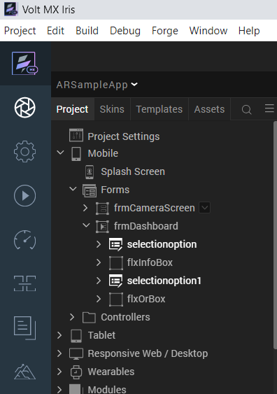

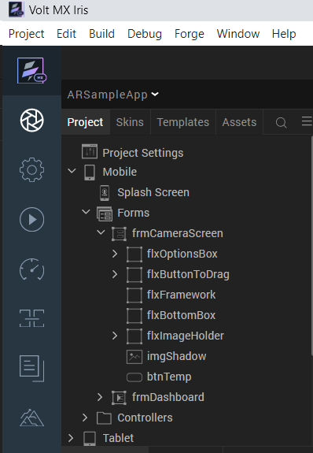

Go to **Templates**, expand **Components** and then verify whether the
components are successfully imported to the existing application.

**Build the App**

From menu bar, go to **Build** and then select **Build Native Local**.

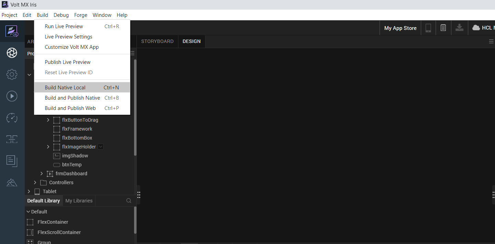

For **Mobile**, select **Android** and **iOS**. Click **Build**.

After the build is successful, run the app on your mobile device

**Application Flow**

The landing page for the app is as follows

Click on Scan and so The AR Renderer will ask the camera permissions as shown in
below.

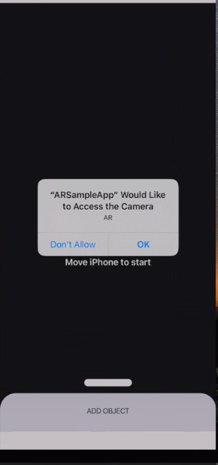

Once click on OK then it will starts searching for a plane surface.

Then add an object and you will see the selected object as show in the following
screen shots.

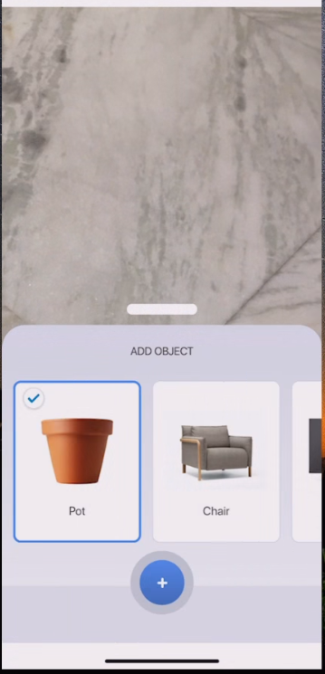

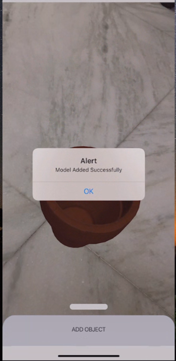

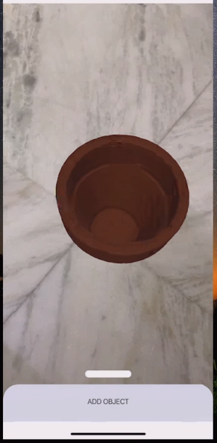

Select another object from list of objects and can see 3d view as shown in below
images.

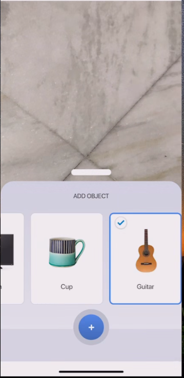

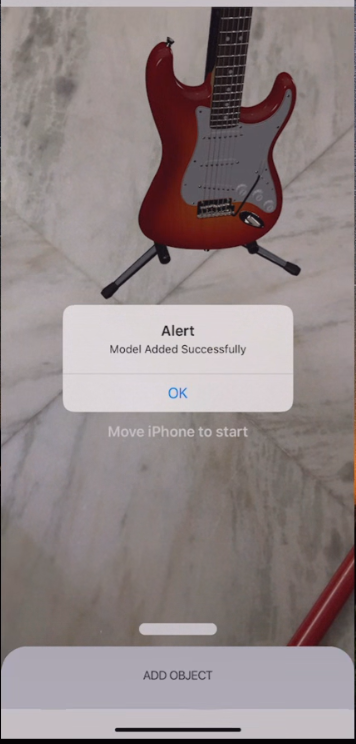

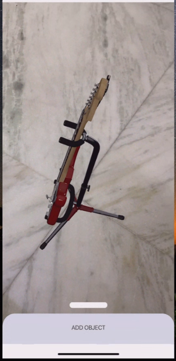

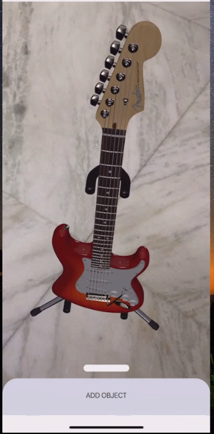

**Note:** For Android, the image is displaying very small and when moving the
camera closely then the image is displaying in big size.
