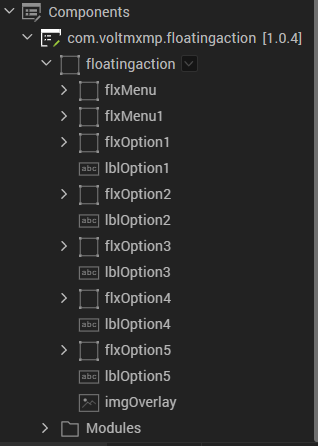

# Floating Action Component (1.0.4)

## 1. Overview

A floating action represents/promotes the primary action in an application. It
is essentially a circular button floating over the UI. When pressed, it may
present more related actions.

### A. Use case

I.	Consider a case that you are developing an email application that allows
    users to skin perform actions, such as compose, send, receive, and read
    emails. Using the Floating Action component, you can add a primary button in
    the app.

II.	When a user taps the primary button, a screen appears where the user can
    compose an email.

III.	The component helps the user to navigate directly to the desired screen in
    the emails list on single click of the primary button instead of multiple
    clicks. This is one of the use cases of the Floating Action component.

IV.	You can add multiple menu items to display when the primary button is
    clicked to perform multiple actions.

V.	You can import the Floating Action component into your app and make use of
    its features. The Floating Action component also facilitates a set of
    properties and events that helps you customize the fields and the
    functionality.

### B. Percentage of re-use:

Approximate 85% of reuse.

### C. Features

-   Promote your app’s primary actions

-   Add up to 5 floating actions

-   Select from 3 prebuilt animations

-   Customize UI with your own icons and text

-   Option to set background overlay

## 2. Getting Started

### A. Prerequisites

Before you start using the Floating Action component, ensure the following:

• [HCL Foundry](https://manage.hclvoltmx.com/)

• Volt MX Iris

### B. Platforms Supported

i. Mobile

	1. iOS

	2. Android

ii. Tablet & iPad

iii. PWA & Responsive Web

### C. Importing the app

You can import the Forge components only into the apps that are of the Reference Architecture type.

**To import the Floating Action component, do the following:**

1. Open your app project in Volt MX Iris.

2. In the Project Explorer, click the Templates Tab

    

3. Right-click **Components**, and then select **Import Component**. The
    **Import Component** dialog box appears.

    

4.Click **Browse** to navigate to the location of the component, select the
    component, and then click **Import**. The component and its associated
    widgets and modules are added to your project.

   

Once you have imported a component to your project, you can easily add the
component to a form.

### D. Building and previewing the app

After performing all the above steps, you can build your app and run it on your
device.

You can then run your app to see the Floating Action work in real time.

## 3.References

### A\. Dynamic Usage

You can also add **Floating Action** component dynamically. To do so,

In the **Project Explorer**, on the **Projects** tab, click **Controllers** section to access the respective **Form Controller**. Create a method and implement the code snippet similar to the sample code mentioned below.

	/*Creating Floating Action component instance*/

	define({

	//Type your controller code here

	onNavigate : function(){

	this.view.preShow=this.preshow;

	},

	preshow: function(){

	this.createComponent();

	},

	createComponent : function(){

	var floatingAction = new com.voltmxmp.floatingaction(

	{

	"clipBounds": true,

	"skin":"sknFlxMenu",

	"id": "floatingaction",

	"height": "100%",

	"width": "100%",

	"top": "0dp",

	"left": "0dp",

	"isVisible": true,

	"zIndex": 1

	}, {}, {}

	);

	floatingAction.height = "79px";

	floatingAction.width = "79px";

	floatingAction.isVisibleMenuItem1 = true;

	floatingAction.isVisibleMenuItem2 = true;

	floatingAction.isVisibleMenuItem3 = true;

	floatingAction.isVisibleMenuItem4 = true;

	floatingAction.isVisibleMenuItem5 = true;

	floatingAction.imgBGOverlaySrc = "voltmxmp_fa_fade_1.png";

	floatingAction.menuItem1BGSrc = "voltmxmp_fa_itemiconbg_1.png";

	floatingAction.menuItem1IconSrc = "voltmxmp_fa_itempen_1.png";

	floatingAction.menuItem1Text = "Write a Message";

	floatingAction.menuItem2BGSrc = "voltmxmp_fa_itemiconbg_1.png";

	floatingAction.menuItem2IconSrc = "voltmxmp_fa_itemstar_1.png";

	floatingAction.menuItem2Text = "Add to Favourites";

	floatingAction.menuItem3BGSrc = "voltmxmp_fa_itemiconbg_1.png";

	floatingAction.menuItem3IconSrc = "voltmxmp_fa_itemprofile_1.png";

	floatingAction.menuItem3Text = "Send to Friend";

	floatingAction.menuItem4BGSrc = "voltmxmp_fa_itemiconbg_1.png";

	floatingAction.menuItem4IconSrc = "voltmxmp_fa_itemdel_1.png";

	floatingAction.menuItem4Text = "Move to Bin";

	floatingAction.menuItem5BGSrc = "voltmxmp_fa_itemiconbg_1.png";

	floatingAction.menuItem5IconSrc = "voltmxmp_fa_itemprofile_1.png";

	floatingAction.menuItem5Text = "My Profile";

	floatingAction.enableOverlay = true;

	floatingAction.menuItemType = "Image and Text";

	floatingAction.animationType = "Default";

	floatingAction.skin1="sknFlxMenu";

	floatingAction.skin2="sknFlxMenu";

	floatingAction.sknMenuItem1Text="voltmxmpfasknLblBlackSmallfork";

	floatingAction.sknMenuItem2Text="voltmxmpfasknLblBlackSmallfork";

	floatingAction.sknMenuItem3Text="voltmxmpfasknLblBlackSmallfork";

	floatingAction.sknMenuItem4Text="voltmxmpfasknLblBlackSmallfork";

	floatingAction.sknMenuItem5Text="voltmxmpfasknLblBlackSmallfork";

	floatingAction.onClickMenuItem1 = function(){};

	floatingAction.onClickMenuItem2 = function(){};

	floatingAction.onClickMenuItem3 = function(){};

	floatingAction.onClickMenuItem4 = function(){};

	floatingAction.onClickMenuItem5 = function(){};

	this.view.add(floatingAction);

	}

	});

In the code snippet, you can edit the properties of the component as per your
requirement. For more information, see Setting Properties. And save the file

### B. Properties

The properties provided on the **Component** tab allow you to customize the UI
elements in the Floating Action component. You can set the properties directly
on the **Component** tab or by writing a JavaScript. This section provides
information on how to set the properties by writing a JavaScript.

**General Properties**

- **Menu Item Fields**

| <!-- -->    | <!-- -->    |
|-------------|-------------|
| **Description:** | Specifies the type of the menu items • Image and Text: Menu Items will have both image and text. • Only Image: Menu Items will have only image. |
| **Syntax:**      | menuItemType                                                                                                                                |
| **Type:**        | List Selector                                                                                                                               |
| **Read/Write:**  | Read + Write                                                                                                                                |
| **Remarks**      | The default value of the property is “Only Image”.                                                                                          |
| **Example:**     | this.view.componentID.menuItemType= “Only Image”;                                                                                           |

- **Animation Type**

| <!-- -->    | <!-- -->    |
|-------------|-------------|
| **Description:** | Specifies the animation type of the menu items. • Rise : Menu items move up from the bottom. • Slide In: Menu items move in from right.   • Default: Menu items appear with default animation. 												|
| **Syntax:**      | animationType                                                                                                                                                                          |
| **Type:**        | List Selector                                                                                                                                                                          |
| **Read/Write:**  | Read + Write                                                                                                                                                                           |
| **Remarks**      | The property requires a String value. You must handle the exceptions if you provide an invalid value.                                                                                  |
| **Example:**     | this.view.componentID.animationType = Default ;                                                                                                                                        |

- **Enable Background Overlay**

| <!-- -->    | <!-- -->    |
|-------------|-------------|
| **Description:** | Controls the visibility of the background overlay.                                                     |
| **Syntax:**      | enableOverlay                                                                                          |
| **Type:**        | Boolean                                                                                                |
| **Read/Write:**  | Read + Write                                                                                           |
| **Remarks**      | The property requires a Boolean value. You must handle the exceptions if you provide an invalid value. |
| **Example:**     | this.view.componentID.enableOverlay = true;                                                            |

- **Background Overlay Image**

| <!-- -->    | <!-- -->    |
|-------------|-------------|
| **Description:** | Specifies the name of the image to be set as the background overlay.                                                                                                                                                                                                                                      |
| **Syntax:**      | imgBGOverlaySrc                                                                                                                                                                                                                                                                                           |
| **Type:**        | String                                                                                                                                                                                                                                                                                                    |
| **Read/Write:**  | Read + Write                                                                                                                                                                                                                                                                                              |
| **Remarks**      | Before setting the property, do the following: • Ensure that the image file exists in the *workspace\\resources\\common* directory. • Do not add any uppercase characters in the file name of the image. • Ensure that the image is in PNG format. • Specify the file name of the image along with the extension. |
| **Example:**     | this.view.componentID.imgBGOverlaySrc = “fade.png”;                                                                                                                                                                                                                                                       |

**Primary Button Properties**

- **Background Image**

| <!-- -->    | <!-- -->    |
|-------------|-------------|
| **Description:** | Specifies the file name of the image to be set as the background for the Primary Button.                                                                                                                                                                                                                  |
| **Syntax:**      | primaryButtonBGSrc                                                                                                                                                                                                                                                                                        |
| **Type:**        | String                                                                                                                                                                                                                                                                                                    |
| **Read/Write:**  | Read + Write                                                                                                                                                                                                                                                                                              |
| **Remarks**      | Before setting the property, do the following: • Ensure that the image file exists in the *workspace\\resources\\common* directory. • Do not add any uppercase characters in the file name of the image. • Ensure that the image is in PNG format. • Specify the file name of the image along with the extension. |
| **Example:**     | this.view.componentID.primaryButtonBGSrc= “bg.png”;                                                                                                                                                                                                                                                       |

- **Icon**

| <!-- -->    | <!-- -->    |
|-------------|-------------|
| **Description:** | Specifies the file name of the image to be set as the Primary Button icon.                                                                                                                                                                                                                                |
| **Syntax:**      | imgPrimaryIcon                                                                                                                                                                                                                                                                                            |
| **Type:**        | String                                                                                                                                                                                                                                                                                                    |
| **Read/Write:**  | Read + Write                                                                                                                                                                                                                                                                                              |
| **Remarks**      | Before setting the property, do the following: • Ensure that the image file exists in the *workspace\\resources\\common* directory. • Do not add any uppercase characters in the file name of the image. • Ensure that the image is in PNG format. • Specify the file name of the image along with the extension. |
| **Example:**     | this.view.componentID.imgPrimaryIcon= “icon_plus.png”;                                                                                                                                                                                                                                                    |

**Menu Item 1 Properties**

- **Visibility**

| <!-- -->    | <!-- -->    |
|-------------|-------------|
| **Description:** | Controls the visibility of Menu item 1.          |
| **Syntax:**      | isVisibleMenuItem1                               |
| **Type:**        | Boolean                                          |
| **Read/Write:**  | Read + Write                                     |
| **Remarks**      | The default value of the property is **true**.   |
| **Example:**     | this.view.componentID.isVisibleMenuItem1 = true; |

- **Background Image**

| <!-- -->    | <!-- -->    |
|-------------|-------------|
| **Description:** | Specifies the file name of the image to be set as the background of Menu item 1.                                                                                                                                                                                                                          |
| **Syntax:**      | menuItem1BGSrc                                                                                                                                                                                                                                                                                            |
| **Type:**        | Image                                                                                                                                                                                                                                                                                                     |
| **Read/Write:**  | Read + Write                                                                                                                                                                                                                                                                                              |
| **Remarks**      | Before setting the property, do the following: • Ensure that the image file exists in the *workspace\\resources\\common* directory. • Do not add any uppercase characters in the file name of the image. • Ensure that the image is in PNG format. • Specify the file name of the image along with the extension. |
| **Example:**     | this.view.componentID.menuItem1BGSrc = “itemiconbg.png”;                                                                                                                                                                                                                                                  |

- **Icon**

| <!-- -->    | <!-- -->    |
|-------------|-------------|
| **Description:** | Specifies the file name of the image to be set as the Menu item 1 icon.                                                                                                                                                                                                                                   |
| **Syntax:**      | menuItem1IconSrc                                                                                                                                                                                                                                                                                          |
| **Type:**        | Image                                                                                                                                                                                                                                                                                                     |
| **Read/Write:**  | Read + Write                                                                                                                                                                                                                                                                                              |
| **Remarks**      | Before setting the property, do the following:  • Ensure that the image file exists in the *workspace\\resources\\common* directory.  • Do not add any uppercase characters in the file name of the image. • Ensure that the image is in PNG format. • Specify the file name of the image along with the extension. |
| **Example:**     | this.view.componentID.menuItem1IconSrc = “itempen.png”;                                                                                                                                                                                                                                                   |

- **Text**

| <!-- -->    | <!-- -->    |
|-------------|-------------|
| **Description:** | Specifies the text to be displayed on the label of Menu item 1. |
| **Syntax:**      | menuItem1Text                                                   |
| **Type:**        | String                                                          |
| **Read/Write:**  | Read + Write                                                    |
| **Remarks**      | The default value of the property is “Label”.                   |
| **Example:**     | this.view.componentID.menuItem1Text = “Label”;                  |

**Menu Item 2 Properties**

- **Visibility**

| <!-- -->    | <!-- -->    |
|-------------|-------------|
| **Description:** | Controls the visibility of Menu item 2.          |
| **Syntax:**      | isVisibleMenuItem2                               |
| **Type:**        | Boolean                                          |
| **Read/Write:**  | Read + Write                                     |
| **Remarks**      | The default value of the property is **true**.   |
| **Example:**     | this.view.componentID.isVisibleMenuItem2 = true; |
|                  |                                                  |

- **Background Image**

| <!-- -->    | <!-- -->    |
|-------------|-------------|
| **Description:** | Specifies the file name of the image to be set as the background of Menu item 2.                                                                                                                                                                                                                          |
| **Syntax:**      | menuItem2BGSrc                                                                                                                                                                                                                                                                                            |
| **Type:**        | Image                                                                                                                                                                                                                                                                                                     |
| **Read/Write:**  | Read + Write                                                                                                                                                                                                                                                                                              |
| **Remarks**      | Before setting the property, do the following: • Ensure that the image file exists in the *workspace\\resources\\common* directory.  • Do not add any uppercase characters in the file name of the image. • Ensure that the image is in PNG format. • Specify the file name of the image along with the extension. |
| **Example:**     | this.view.componentID.menuItem2BGSrc = “itemiconbg.png”;                                                                                                                                                                                                                                                  |

- **Icon**

| <!-- -->    | <!-- -->    |
|-------------|-------------|
| **Description:** | Specifies the file name of the image to be set as the Menu item 2 icon.                                                                                                                                                                                                                                   |
| **Syntax:**      | menuItem2IconSrc                                                                                                                                                                                                                                                                                          |
| **Type:**        | Image                                                                                                                                                                                                                                                                                                     |
| **Read/Write:**  | Read + Write                                                                                                                                                                                                                                                                                              |
| **Remarks**      | Before setting the property, do the following: • Ensure that the image file exists in the *workspace\\resources\\common* directory. • Do not add any uppercase characters in the file name of the image. • Ensure that the image is in PNG format. • Specify the file name of the image along with the extension. |
| **Example:**     | this.view.componentID.menuItem2IconSrc = “itemstar.png”;                                                                                                                                                                                                                                                  |

- **Text**

| <!-- -->    | <!-- -->    |
|-------------|-------------|
| **Description:** | Specifies the text to be displayed on the label of Menu item 2. |
| **Syntax:**      | menuItem2Text                                                   |
| **Type:**        | String                                                          |
| **Read/Write:**  | Read + Write                                                    |
| **Remarks**      | The default value of the property is “Label”.                   |
| **Example:**     | this.view.componentID.menuItem2Text = “Label”;                  |

**Menu Item 3 Properties**

- **Visibility**

| <!-- -->    | <!-- -->    |
|-------------|-------------|
| **Description:** | Controls the visibility of Menu item 3.          |
| **Syntax:**      | isVisibleMenuItem3                               |
| **Type:**        | Boolean                                          |
| **Read/Write:**  | Read + Write                                     |
| **Remarks**      | The default value of the property is **true**.   |
| **Example:**     | this.view.componentID.isVisibleMenuItem3 = true; |

- **Background Image**

| <!-- -->    | <!-- -->    |
|-------------|-------------|
| **Description:** | Specifies the file name of the image to be set as the background of Menu item 3.                                                                                                                                                                                                                          |
| **Syntax:**      | menuItem3BGSrc                                                                                                                                                                                                                                                                                            |
| **Type:**        | Image                                                                                                                                                                                                                                                                                                     |
| **Read/Write:**  | Read + Write                                                                                                                                                                                                                                                                                              |
| **Remarks**      | Before setting the property, do the following:  •Ensure that the image file exists in the *workspace\\resources\\common* directory. • Do not add any uppercase characters in the file name of the image. • Ensure that the image is in PNG format. • Specify the file name of the image along with the extension. |
| **Example:**     | this.view.componentID.menuItem3BGSrc = “itemiconbg.png”;                                                                                                                                                                                                                                                  |

- **Icon**

| <!-- -->    | <!-- -->    |
|-------------|-------------|
| **Description:** | Specifies the file name of the image to be set as the Menu item 3 icon.                                                                                                                                                                                                                                   |
| **Syntax:**      | menuItem3IconSrc                                                                                                                                                                                                                                                                                          |
| **Type:**        | Image                                                                                                                                                                                                                                                                                                     |
| **Read/Write:**  | Read + Write                                                                                                                                                                                                                                                                                              |
| **Remarks**      | Before setting the property, do the following: • Ensure that the image file exists in the *workspace\\resources\\common* directory. • Do not add any uppercase characters in the file name of the image. • Ensure that the image is in PNG format. • Specify the file name of the image along with the extension. |
| **Example:**     | this.view.componentID.menuItem3IconSrc = “itemprofile.png”;                                                                                                                                                                                                                                               |

- **Text**

| <!-- -->    | <!-- -->    |
|-------------|-------------|
| **Description:** | Specifies the text to be displayed on the label of Menu item 3. |
| **Syntax:**      | menuItem3Text                                                   |
| **Type:**        | String                                                          |
| **Read/Write:**  | Read + Write                                                    |
| **Remarks**      | The default value of the property is “Label”.                   |
| **Example:**     | this.view.componentID.menuItem3Text = “Label”;                  |

**Menu Item 4 Properties**

- **Visibility**

| <!-- -->    | <!-- -->    |
|-------------|-------------|
| **Description:** | Controls the visibility of Menu item 4.           |
| **Syntax:**      | isVisibleMenuItem4                                |
| **Type:**        | Boolean                                           |
| **Read/Write:**  | Read + Write                                      |
| **Remarks**      | The default value of the property is **false**.   |
| **Example:**     | this.view.componentID.isVisibleMenuItem4 = false; |

- **Background Image**

| <!-- -->    | <!-- -->    |
|-------------|-------------|
| **Description:** | Specifies the file name of the image to be set as the background of Menu item 4.                                                                                                                                                                                                                          |
| **Syntax:**      | menuItem4BGSrc                                                                                                                                                                                                                                                                                            |
| **Type:**        | Image                                                                                                                                                                                                                                                                                                     |
| **Read/Write:**  | Read + Write                                                                                                                                                                                                                                                                                              |
| **Remarks**      | Before setting the property, do the following: • Ensure that the image file exists in the *workspace\\resources\\common* directory. • Do not add any uppercase characters in the file name of the image.  • Ensure that the image is in PNG format. • Specify the file name of the image along with the extension. |
| **Example:**     | this.view.componentID.menuItem4BGSrc = “itemiconbg.png”;                                                                                                                                                                                                                                                  |

- **Icon**

| <!-- -->    | <!-- -->    |
|-------------|-------------|
| **Description:** | Specifies the file name of the image to be set as the Menu item 4 icon.                                                                                                                                                                                                                                   |
| **Syntax:**      | menuItem4IconSrc                                                                                                                                                                                                                                                                                          |
| **Type:**        | Image                                                                                                                                                                                                                                                                                                     |
| **Read/Write:**  | Read + Write                                                                                                                                                                                                                                                                                              |
| **Remarks**      | Before setting the property, do the following: • Ensure that the image file exists in the *workspace\\resources\\common* directory. • Do not add any uppercase characters in the file name of the image. • Ensure that the image is in PNG format. • Specify the file name of the image along with the extension. |
| **Example:**     | this.view.componentID.menuItem4IconSrc = “itemdel.png”;                                                                                                                                                                                                                                                   |

- **Text**

| <!-- -->    | <!-- -->    |
|-------------|-------------|
| **Description:** | Specifies the text to be displayed on the label of Menu item 4. |
| **Syntax:**      | menuItem4Text                                                   |
| **Type:**        | String                                                          |
| **Read/Write:**  | Read + Write                                                    |
| **Remarks**      | The default value of the property is “Label”.                   |
| **Example:**     | this.view.componentID.menuItem4Text = “Label”;                  |

**Menu Item 5 Properties**

- **Visibility**

| <!-- -->    | <!-- -->    |
|-------------|-------------|
| **Description:** | Controls the visibility of Menu item 5.           |
| **Syntax:**      | isVisibleMenuItem5                                |
| **Type:**        | Boolean                                           |
| **Read/Write:**  | Read + Write                                      |
| **Remarks**      | The default value of the property is **false**.   |
| **Example:**     | this.view.componentID.isVisibleMenuItem5 = false; |

- **Background Image**

| <!-- -->    | <!-- -->    |
|-------------|-------------|
| **Description:** | Specifies the file name of the image to be set as the background of Menu item 5.                                                                                                                                                                                                                          |
| **Syntax:**      | menuItem5BGSrc                                                                                                                                                                                                                                                                                            |
| **Type:**        | Image                                                                                                                                                                                                                                                                                                     |
| **Read/Write:**  | Read + Write                                                                                                                                                                                                                                                                                              |
| **Remarks**      | Before setting the property, do the following: • Ensure that the image file exists in the *workspace\\resources\\common* directory. • Do not add any uppercase characters in the file name of the image. • Ensure that the image is in PNG format. • Specify the file name of the image along with the extension. |
| **Example:**     | this.view.componentID.menuItem5BGSrc = “itemiconbg.png”;                                                                                                                                                                                                                                                  |

- **Icon**

| <!-- -->    | <!-- -->    |
|-------------|-------------|
| **Description:** | Specifies the file name of the image to be set as the Menu item 5 icon.                                                                                                                                                                                                                                   |
| **Syntax:**      | menuItem5IconSrc                                                                                                                                                                                                                                                                                          |
| **Type:**        | Image                                                                                                                                                                                                                                                                                                     |
| **Read/Write:**  | Read + Write                                                                                                                                                                                                                                                                                              |
| **Remarks**      | Before setting the property, do the following: • Ensure that the image file exists in the *workspace\\resources\\common* directory. • Do not add any uppercase characters in the file name of the image.  • Ensure that the image is in PNG format. • Specify the file name of the image along with the extension. |
| **Example:**     | this.view.componentID.menuItem5IconSrc = “itemprofile.png”;                                                                                                                                                                                                                                               |

- **Text**

| <!-- -->    | <!-- -->    |
|-------------|-------------|
| **Description:** | Specifies the text to be displayed on the label of Menu item 5. |
| **Syntax:**      | menuItem5Text                                                   |
| **Type:**        | String                                                          |
| **Read/Write:**  | Read + Write                                                    |
| **Remarks**      | The default value of the property is “Label".                   |
| **Example:**     | this.view.componentID.menuItem5Text = "Label";                  |

### Skin

You can select skins from the **Exposed Skins** drop-down list on the **Skin**
tab. This section provides information on how to set Skin by writing a
JavaScript.

- **Menu Item 1 Text**

| <!-- -->    | <!-- -->    |
|-------------|-------------|
| **Description:** | Specifies the skin for the text of Menu item 1.                                                           |
| **Syntax:**      | sknMenuItem1Text                                                                                          |
| **Type:**        | String                                                                                                    |
| **Read/Write:**  | Read + Write                                                                                              |
| **Remarks**      | Before you set the property, ensure that the skin ID that you specify already exists in your app project. |
| **Example:**     | this.view.componentID.sknMenuItem1Text= "skinname";                                                       |

- **Menu Item 2 Text**

| <!-- -->    | <!-- -->    |
|-------------|-------------|
| **Description:** | Specifies the skin for the text of Menu item 2.                                                           |
| **Syntax:**      | sknMenuItem2Text                                                                                          |
| **Type:**        | String                                                                                                    |
| **Read/Write:**  | Read + Write                                                                                              |
| **Remarks**      | Before you set the property, ensure that the skin ID that you specify already exists in your app project. |
| **Example:**     | this.view.componentID.sknMenuItem2Text= "skinname";                                                       |

- **Menu Item 3 Text**

| <!-- -->    | <!-- -->    |
|-------------|-------------|
| **Description:** | Specifies the skin for the text of Menu item 3.                                                           |
| **Syntax:**      | sknMenuItem3Text                                                                                          |
| **Type:**        | String                                                                                                    |
| **Read/Write:**  | Read + Write                                                                                              |
| **Remarks**      | Before you set the property, ensure that the skin ID that you specify already exists in your app project. |
| **Example:**     | this.view.componentID.sknMenuItem3Text= "skinname";                                                       |

- **Menu Item 4 Text**

| <!-- -->    | <!-- -->    |
|-------------|-------------|
| **Description:** | Specifies the skin for the text of Menu item 4.                                                           |
| **Syntax:**      | sknMenuItem4Text                                                                                          |
| **Type:**        | String                                                                                                    |
| **Read/Write:**  | Read + Write                                                                                              |
| **Remarks**      | Before you set the property, ensure that the skin ID that you specify already exists in your app project. |
| **Example:**     | this.view.componentID.sknMenuItem4Text= "skinname";                                                       |

- **Menu Item 5 Text**

| <!-- -->    | <!-- -->    |
|-------------|-------------|
| **Description:** | Specifies the skin for the text of Menu item 5.                                                           |
| **Syntax:**      | sknMenuItem5Text                                                                                          |
| **Type:**        | String                                                                                                    |
| **Read/Write:**  | Read + Write                                                                                              |
| **Remarks**      | Before you set the property, ensure that the skin ID that you specify already exists in your app project. |
| **Example:**     | this.view.componentID.sknMenuItem5Text= "skinname";                                                       |

### C. Events

You can define events to be executed when an action is performed. You can
configure the events directly on the **Actions** tab or by writing a JavaScript.
To configure the events on the **Action** tab, click **Edit** against each
event.

- **onClickMenuItem1**

| <!-- -->    | <!-- -->    |
|-------------|-------------|
| **Description:** | The event is invoked when a user clicks Menu item 1. Clicking the menu item invokes the assigned action and hides the menu items simultaneously. |
| **Syntax:**      | onClickMenuItem1()                                                                                                                               |
| **Example:**     | this.view.componentID.onClickMenuItem1= function()  {   alert( Menu item 1 Clicked );  }                                          |

- **onClickMenuItem2**

| <!-- -->    | <!-- -->    |
|-------------|-------------|
| **Description:** | The event is invoked when a user clicks Menu item 2. Clicking on the Menu item invokes the assigned action and hides the menu icons. |
| **Syntax:**      | onClickMenuItem2()                                                                                                                   |
| **Example:**     | this.view.componentID.onClickMenuItem2= function()  {   alert( Menu item 2 Clicked );  }                                                |
|                  |                                                                                                                                      |
|                  |                                                                                                                                      |

- **onClickMenuItem3**

| <!-- -->    | <!-- -->    |
|-------------|-------------|
| **Description:** | The event is invoked when a user clicks Menu item 3. Clicking the menu item invokes the assigned action and hides the menu items simultaneously. |
| **Syntax:**      | onClickMenuItem3()                                                                                                                               |
| **Example:**     | this.view.componentID.onClickMenuItem3= function()  {   alert( Menu item 3 Clicked );  }                                                            |

- **onClickMenuItem4**

| <!-- -->    | <!-- -->    |
|-------------|-------------|
| **Description:** | The event is invoked when a user clicks Menu item 4. Clicking the menu item invokes the assigned action and hides the menu items simultaneously. |
| **Syntax:**      | onClickMenuItem4()                                                                                                                               |
| **Example:**     | this.view.componentID.onClickMenuItem4= function()  {   alert( Menu item 4 Clicked );  }                                                            |

- **onClickMenuItem5**

| <!-- -->    | <!-- -->    |
|-------------|-------------|
| **Description:** | The event is invoked when a user clicks Menu item 5. Clicking the menu item invokes the assigned action and hides the menu items simultaneously. |
| **Syntax:**      | onClickMenuItem5()                                                                                                                               |
| **Example:**     | this.view.componentID.onClickMenuItem5= function()  {   alert( Menu item 5 Clicked );  }                                          |

- **onClickPrimaryButton**

| <!-- -->    | <!-- -->    |
|-------------|-------------|
| **Description:** | The event is invoked when a user clicks the Primary Button. The Primary Button will show/hide the menu items. |
| **Syntax:**      | onClickPrimaryButton()                                                                                        |
| **Example:**     | this.view.componentID.onClickPrimaryButton= function()  {   alert( Primary button Clicked );  }                  |

## 4. REVISION HISTORY

App version: 1.0.4

### A. Known Issues

1.  Extra space is displayed next to the floating action Icons.

2.  UI is getting distorted at lower break points

3.  In iPhone safari background images width is compressed for each icon

4.  After changing a break point one must click on the primary button to make
    menu visible (even if it is ON previously)

### B. Limitations

1. Landscape mode is not supported.

2. If browser height is minimized UI gets distorted.
