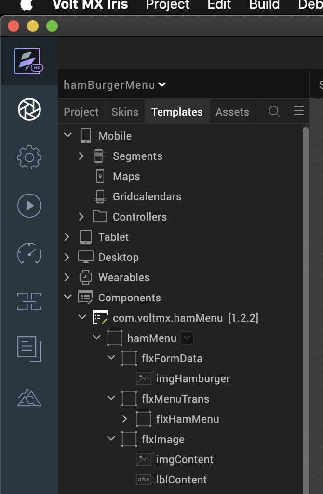

# HAMBURGER MENU (1.2.2)

## 1.  Overview

Hamburger Menu adds a menu to your application. You can click or tap the
hamburger icon to open a menu that contains a header, a list of menu items,
and a footer. Every menu item has an icon and a label.

You can add and edit menu items, change the header text or the footer text,
and add actions to execute when a menu item is clicked. You can use the
Hamburger Menu component in scenarios where you want to save screen space
without losing out on functionality.

### A. Use case

To hide the navigation menu to the edge of the screen and reveal it only after a
user’s action. This pattern can be particularly useful if you want your user to
focus on the main content.

### B.  Features

The component allows you to hide the navigation menu to the edge of the
screen and reveal it only after a user’s action

### C. Percentage of re-use:

90%

## 2. GETTING STARTED

### A. Prerequisites

Before you start using the Hamburger Menu component, ensure the following:

-   [HCL Foundry](https://manage.hclvoltmx.com/)

-   Volt MX Iris

### B. Platforms Supported

i.  Mobile

	1.  iOS

	2.  Android

ii.  Tablets

iii.  PWA

### C. Importing the Component

You can import the Forge components only into the apps that are of the Reference
Architecture type.

**To import the Hamburger Menu component, do the following:**

1.Open your app project in Volt MX Iris.

2.In the Project Explorer, click the **Templates** tab.

3.Right-click **Components**, and then select **Import Component**. The **Import
Component** dialog box appears.

4.Click **Browse** to navigate to the location of the component, select the
component, and then click **Import**. The component and its associated widgets
and modules are added to your project.

Once you have imported a component to your project, you can easily add the
component to a form. For more information, refer [Add a Component to a
Form](https://opensource.hcltechsw.com/volt-mx-docs/docs/documentation/Iris/iris_user_guide/Content/C_UsingComponents.html%22%20/l%20%22add-a-component-to-a-form).

### D.  Building and previewing the app

After performing all the above steps, you can build your app and run it on
your device. For more information, you can refer to the [Building and
Viewing an
Application](https://opensource.hcltechsw.com/volt-mx-docs/docs/documentation/Iris/iris_user_guide/Content/Cloud_Build_in_VoltMX_Iris.html#cloud)
section of the Iris User Guide.

You can then run your app to see the Hamburger Menu work in real time.

## 3.  REFERENCES

### A.  Dynamic Usage

You can also add a **Hamburger Menu**  component dynamically. To do so,

1\.  In the **Project Explorer**, on the **Projects** tab, click **Controllers**
    section to access the respective **Form Controller**. Create a method and
    implement the code snippet similar to the sample code mentioned below.

	define({

	//Type your controller code here

	onNavigate: function(){

	var HamMenu = new com.voltmx.hamMenu({

	"clipBounds": true,

	"height": "100%",

	"id": "hamMenu",

	"isVisible": true,

	"left": "0dp",

	"top": "0dp",

	"width": "100%",

	"zIndex": 1

	},{},{});

	HamMenu.flxHamMenuwidth="50%";

	HamMenu.sknHamMenu="voltmxsmhamMenu";

	/\*Adding the component to a Form\*/

	this.view.add(HamMenu);

	var sampleData = [{lblMenuItem: "Home"},

	{lblMenuItem: "Accounts"},

	{lblMenuItem: "Contacts"},

	{lblMenuItem: "Users"}

	];

	this.view.hamMenu.setData(sampleData);

	/* Defining events for the component */

	this.view.hamMenu.onMenuItemClick= this.onRowClick;

	},

	onRowClick:function(){

	this.view.hamMenu.setMenuVisibility(false);

	}

	});

  In the code snippet, you can edit the properties of the component as per
  your requirement. For more information, see Setting Properties.

2. **Save** the file.

### B. Properties

You can use a component's **Properties** to customize and configure the
elements. These elements can be UI elements, service parameters, and so on.

You can set the properties from the Iris Properties panel on the right hand
side. You can also configure these properties using a JavaScript code.

**1. Menu Items**

|<!-- --> |<!-- -->|
|---------|--------|
| Description:	   | Specifies the list of menu items that you want to display on the component 		                                                       |
| Syntax  :        | menuItems                                                                                                                                    |
|  Type   :   | Master Data  Array of JSON |
| Read/Write :	| Read + Write						|

On Iris , you can specify the menu items from Master Data

**Example :**

  var sampleData = [{lblMenuItem: "Home"},

  {lblMenuItem: "Accounts"},

  {lblMenuItem: "Contacts"},

  {lblMenuItem: "Users"}

  ];

  this.view.hamMenu.setData(sampleData);

**2.Flex Hamburger Menu Width (flxHamMenuWidth)**

| <!-- -->    | <!-- -->    |
|-------------|-------------|
| **Description** : | This property enables the consumer to change the Flex Width of the Hamburger Menu component		|
| Syntax  :        | flxHamMenuWidth                                          |             
|  Type   :   | Flex Container |
| Read/Write :	| Read + Write						|
| Example **:**| HamMenu.flxHamMenuwidth="50%";				|					

**3.Flex Hamburger Menu skin(flxHamMenuskin)**

| <!-- -->    | <!-- -->    |
|-------------|-------------|
| **Description** : | This property enables the consumer to change the Flex Skin of the Hamburger Menu component.			|
| Syntax  :        | flxHamMenuskin	                                          |             
|  Type   :   | Flex Container |
| Read/Write :	| Read + Write						|
| Example **:**| HamMenu.sknHamMenu="voltmxsmhamMenu";					|

### C. **Events**

The component invokes events when its corresponding action is performed. You can
configure any logic you want the component to perform whenever an event occurs.
You can configure the events by writing a JavaScript

**1.onMenuItemClick**

| <!-- -->    | <!-- -->    |
|-------------|-------------|
| Description:	   | Invoked when the user taps or clicks a menu item.                                                                                                 |
| Syntax  :        | onMenuItemClick  menuItemObject                                                                                                               |
|  Parameters  :   | Contains the following keys:  • menuItemIndex : The index of the menu item. • menuItemText : The text from the label of the menu item. |
| Example : 	   |this.view.hamMenu.onMenuItemClick= this.onRowClick; onRowClick:function(){ this.view.hamMenu.setMenuVisibility(false); }     |			

### D.  APIs

The following APIs pertain to the Hamburger Menu component:

**1.  setMenuVisibility**

| <!-- -->    | <!-- -->    |
|-------------|-------------|
| Description:	   | Sets the visibility of the Menu for the form.                                                                                                |
| Syntax :     |   setMenuVisibility(formReference)                                                                                                   |
| Parameters :     | isVisible                                                                                                                                   |
| Example :    | this.view.hamMenu.setMenuVisibility(false); |

**2.  setData**

| <!-- -->    | <!-- -->    |
|-------------|-------------|
| Description:	   | Sets the Data to the Form.                                                                                          |
| Syntax :     |   setData(formReference)                                                                                               |
| Parameters :     | data                                                                                                                                  |
| Example :    |this.view.hamMenu.setData(sampleData); |

## 4.  REVISION HISTORY

App version 1.2.2
