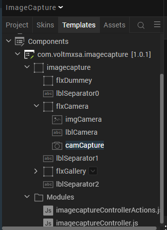

# IMAGE CAPTURE (1.0.1)

# 1. OVERVIEW

This component provides an easy way to capture and save images as base64 string
into the application.

## A. Use case:

This use case is especially of use in field service applications where an
agent/technician needs to capture the defects, work done and other such
information.

## B. Percentage of re-use:

Approximately 85% of reuse.

## C. Features:

-   Offline support for image capture

-   Images saved as base64 string format

-   Option to review as soon as you have captured the image

-   All saved images can be rendered using Volt MX Iris’s image widget

-   Compression ratio support for capturing images

# 2. GETTING STARTED

## A. Prerequisites

Before you start using the Image Capture component, ensure the following:

• [HCL Foundry](https://manage.hclvoltmx.com/)

• Volt MX Iris

## B. Platforms Supported

i. Mobile

	1.	iOS

	2.	Android

ii. Tablet & iPad

iii. PWA & Responsive Web

## c. Importing the app

You can import the Forge components only into the apps that are of the Reference
Architecture type.

**To import the Image Capture component, do the following:**

1.  Open your app project in Volt MX Iris.

2.  In the Project Explorer, click the **Templates** tab.

3.  Right-click **Components**, and then select **Import Component**. The
    **Import Component** dialog box appears.

    

4.  Click **Browse** to navigate to the location of the component, select the
    component, and then click **Import**. The component and its associated
    widgets and modules are added to your project.

Once you have imported a component to your project, you can easily add the
component to a form. For more information, refer [Add a Component to a
Form](https://opensource.hcltechsw.com/volt-mx-docs/docs/documentation/Iris/iris_user_guide/Content/C_UsingComponents.html%22%20/l%20%22add-a-component-to-a-form)

## D. Building and previewing the app

After performing all the above steps, you can build your app and run it on your
device. For more information, you can refer to the [Building and Viewing an
Application](https://opensource.hcltechsw.com/volt-mx-docs/docs/documentation/Iris/iris_user_guide/Content/Cloud_Build_in_VoltMX_Iris.html#cloud)
section of the Volt MX User Guide.

You can then run your app to see the Image Capture work in real time.

# 3. REFERENCES

## A. Dynamic Usage

You can also add **Image Capture** component dynamically. To do so,

1\. In the **Project Explorer**, on the **Projects** tab, click **Controllers**
section to access the respective **Form Controller**. Create a method and
implement the code snippet like the sample code mentioned below.

~~~~~~~~~~~~~~~~~~~~~~~~~~~~~~~~~~~~~~~~~~~~~~~~~~~~~~~~~~~~~~~~~~~~~~~~~~~~~~~~
    /* Creating Image Capture component instance */

    var imgCaptureInstance = new com.voltmxsa.imagecapture ({

    "clipBounds": true,

    "height": "100%",

    "id": "imagecapture",

    "isVisible": true,

    "left": "0dp",

    "top": "0dp",

    "width": "100%",

    "zIndex":1

    }, {}, {});

    /\*Setting the component's properties\*/

    imgCaptureInstance.skinFlxCamera="sknFlxCompCamera";

    imgCaptureInstance.sknLblCamera="sknLblCompCamera";

    imgCaptureInstance.sknFlxGallery="sknFlxCompGallery";

    imgCaptureInstance.sknLblGallery="sknLblCompCamera";

    imgCaptureInstance.sknLblSeparator0="sknLblCompImgSeparator";

    imgCaptureInstance.sknLblSeparator2="sknLblCompImgSeparator";

    imgCaptureInstance.toggleBackground(true);

    imgCaptureInstance.onImageSelection = function(){

    alert(" onImageSection executed");

    };

    /\*Adding the Image Capture component to a Form\*/

    this.view.add(imgCaptureInstance);
~~~~~~~~~~~~~~~~~~~~~~~~~~~~~~~~~~~~~~~~~~~~~~~~~~~~~~~~~~~~~~~~~~~~~~~~~~~~~~~~

In the code snippet, you can edit the properties of the component as per your
requirement. For more information, see Setting Properties.

**2. Save the file**

**A. Properties**

The properties provided on the Component tab allows you to customize the
elements in the Image Capture component. These elements can be UI elements,
service parameters, and so on. You can set the properties from the Volt MX Iris
Properties panel on the right-hand side. You can also configure these properties
using a JavaScript code.

**General Properties**

**Skins Section**

**1.Header**

**1. Camera flex Background Skin(sknFlxCompCamera)**

| **Description:** | Specifies the skin that is applied to the flex container of Camera. |
|------------------|---------------------------------------------------------------------|
| Syntax:          | sknFlxCompCamera                                                    |
| **Type:**        | String                                                              |
| **Read/Write:**  | Read + Write                                                        |
| **Example:**     | this.view.imagecapture.skinFlxCamera="sknFlxCompCamera";            |
| **Remarks:**     | The default value for the property is “sknFlxCompCamera”.           |

**2. Camera text and color(sknLblCompCamera)**

| **Description:** | Specifies the skin that is applied to the label of Camera. |
|------------------|------------------------------------------------------------|
| Syntax:          | sknLblCompCamera                                           |
| **Type:**        | String                                                     |
| **Read/Write:**  | Read + Write                                               |
| **Example:**     | this.view.imagecapture.sknLblCamera="sknLblCompCamera";    |
| **Remarks:**     | The default value for the property is “sknLblCompCamera”.  |

**3. Gallery flex Background Skin(sknFlxCompGallery)**

| **Description:** | Specifies the skin that is applied to the flex container of Gallery. |
|------------------|----------------------------------------------------------------------|
| Syntax:          | sknFlxCompGallery                                                    |
| **Type:**        | String                                                               |
| **Read/Write:**  | Read + Write                                                         |
| **Example:**     | this.view.imagecapture.sknFlxGallery="sknFlxCompGallery";            |
| **Remarks:**     | The default value for the property is “sknFlxCompGallery”.           |

**4. Gallery text and color(sknLblCompCamera)**

| **Description:** | Specifies the skin that is applied to the label of Gallery. |
|------------------|-------------------------------------------------------------|
| Syntax:          | sknFlxCompCamera                                            |
| **Type:**        | String                                                      |
| **Read/Write:**  | Read + Write                                                |
| **Example:**     | this.view.imagecapture.sknLblCamera="sknLblCompCamera";     |
| **Remarks:**     | The default value for the property is “sknLblCompCamera”.   |

**5. Separator flex Background Skin(sknLblCompImgSeparator)**

| **Description:** | Specifies the skin that is applied to the separator flex container. |
|------------------|---------------------------------------------------------------------|
| Syntax:          | sknLblCompImgSeparator                                              |
| **Type:**        | String                                                              |
| **Read/Write:**  | Read + Write                                                        |
| **Example:**     | this.view.imagecapture.sknLblSeparator0="sknLblCompImgSeparator";   |
| **Remarks:**     | The default value for the property is “sknLblCompImgSeparator”.     |

**6. Separator flex Background Skin(sknLblCompImgSeparator)**

| **Description:** | Specifies the skin that is applied to the separator flex container. |
|------------------|---------------------------------------------------------------------|
| Syntax:          | sknLblCompImgSeparator                                              |
| **Type:**        | String                                                              |
| **Read/Write:**  | Read + Write                                                        |
| **Example:**     | this.view.imagecapture.sknLblSeparator2=" sknLblCompImgSeparator "; |
| **Remarks:**     | The default value for the property is “sknLblCompImgSeparator”.     |

**7. Background skin of flex dummy(sknFlxInspectionGreyOverlay)**

| **Description:** | Specifies the skin that is applied to the background color flex container. |
|------------------|----------------------------------------------------------------------------|
| Syntax:          | sknFlxInspectionGreyOverlay                                                |
| **Type:**        | String                                                                     |
| **Read/Write:**  | Read + Write                                                               |
| **Example:**     | this.view.imagecapture. sknFlxBackground=" sknFlxInspectionGreyOverlay ";  |
| **Remarks:**     | The default value for the property is “sknFlxInspectionGreyOverlay”.       |
|                  |                                                                            |

**C. API’s**

1.  toggleBackground

| **Description:**  | This is the custom method to display the background colour of component |
|-------------------|-------------------------------------------------------------------------|
| Syntax:           | toggleBackground()                                                      |
| **Parameters:**   | True or False                                                           |
| **Return Value:** | None                                                                    |
| **Example:**      | this.view.imagecapture.toggleBackground(true);                          |

**D. Events**

1.  onImageSelection

| **Description:** | The event is invoked when a user wants to select the image.                                       |
|------------------|---------------------------------------------------------------------------------------------------|
| Syntax:          | onImageSelection()                                                                                |
| **Example:**     | this. view. ImageCapture. onImageSelection= function () { alert (“onImageSelection executed”); }; |

**Project Settings**:

We need to give permissions for Android Mobile/Tablet to open Camera and Gallery

We need to give permissions for iPhone / iPad to open Camera and Gallery

in **infoplist_configuration** file.

**\WorkspaceName\ProjectName\resources\common\infoplist_configuration** 

~~~~~~~~~~~~~~~~~~~~~~~~~~~~~~~~~~~~~~~~~~~~~~~~~~~~~~~~~~~~~~~~~~~~~~~~~~~~~~~~
{

"NSCameraUsageDescription" : " This app uses Camera ",

"NSPhotoLibraryUsageDescription" : "This app uses photo library"

}
~~~~~~~~~~~~~~~~~~~~~~~~~~~~~~~~~~~~~~~~~~~~~~~~~~~~~~~~~~~~~~~~~~~~~~~~~~~~~~~~

# 4. REVISION HISTORY

App version 1.0.1:

## A. Limitations

No Limitations.

## B. Known issues

Web capture is not present in Chrome browser.
