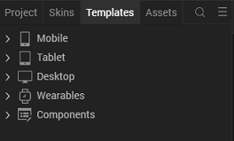

# IMAGE GALLERY (1.0.1)

## 1. Overview

Image Gallery component lets you view all the captured images.

### A. Use case

Consider that you are developing any application in which we need to display
images, in such cases this Image Gallery Component can be used.

### B. Percentage of re-use:

Approximately 85% reusable.

### C. Features

-   All the captured images displayed in a simple horizontally scrollable
    thumbnail format

-   Size of the thumbnail area dynamically decided based on number of images

## 2. Getting Started

### A. Prerequisites

Before you start using the Image Gallery component, ensure the following:

-   [HCL Foundry](https://manage.hclvoltmx.com/)

-   Volt MX Iris

### B. Platforms Supported

-       Mobile

    -   iOS

    -   Android

-       Tablet & iPad

-       PWA & Responsive Web

### C. Importing the app

You can import the Forge components only into the apps that are of the
Reference Architecture type.

**To import the Image Gallery component, do the following:**

1. Open your app project in Volt MX Iris.

2. In the Project Explorer, click the Templates tab.

   

3. Right-click Components, and then select Import Component. The Import Component dialog box appears. 

4. Click Browse to navigate to the location of the component, select the component, and then click Import. The component and its associated widgets and modules are added to your project.

   

Once you have imported a component to your project, you can easily add the
component to a form. For more information, refer Add a Component to a Form

### D. Building and previewing the app

After performing all the above steps, you can build your app and run it on your
device. For more information, you can refer to the [Building and Viewing an
Application](https://opensource.hcltechsw.com/volt-mx-docs/docs/documentation/Iris/iris_user_guide/Content/Cloud_Build_in_VoltMX_Iris.html#cloud)
section of the Volt MX User Guide.

You can then run your app to see the Image Gallery work in real time.

## 3. References

### A. Dynamic Usage

You can also add **Image Gallery component** dynamically. To do so,

1\. In the **Project Explorer**, on the **Projects** tab, click **Controllers**
section to access the respective **Form Controller**. Create a method and
implement the code snippet like the sample code mentioned below.

    /*Creating a Component Object*/

    var imageGalleryInstance = new com.voltmxsa.ImageGallery ({
      "clipBounds": true,
      "height": "100%",
      "id": "ImageGallery",
      "isVisible": true,
      "left": "0dp",
      "top": "0dp",
      "width": "100%",
       "zIndex":"1"
    }, {}, {
    });
     this.view.add(imageGalleryInstance);
     this.view.ImageGallery.flxItemSkin="sknFlxThumbBGWhite";

In the code snippet, you can edit the properties of the component as per your
requirement. For more information, see Setting Properties.

2\. Save the file

**Hidden Widgets**

  

### B. Properties

The properties provided on the **Component** tab allows you to customize the
elements in the **Image Gallery** component. These elements can be UI elements,
service parameters, and so on. You can set the properties from the Volt MX Iris
Properties panel on the right-hand side. You can also configure these properties
using a JavaScript code.

#### General Properties

**1\. TextProperties**

**1\. Title Text (lblTileText):** This Property can be used when we use hidden
widgets

| <!-- -->    | <!-- -->    |
|-------------|-------------|
| **Description:** | Specifies the skin to be applied to the Flex container.                |
| **Syntax:**      | lblTitleText                                                           |
| **Type:**        | String                                                                 |
| **Read/Write:**  | Read + Write                                                           |
| **Example:**     | this. view. ImageGallery. lblTitleText = " PICK FROM DEVICE GALLERY "; |
| Remarks:         | The default value for the property is “PICK FROM DEVICE GALLERY”.      |

**2.Exposed Skins**

**1.flxpickfromGallerySkin:** This Property can be used when we use hidden widgets

| <!-- -->    | <!-- -->    |
|-------------|-------------|
| **Description:** | Specifies the skin to be applied to the Flex container.             |
| **Syntax:**      | flxpickfromGallerySkin                                              |
| **Type:**        | String                                                              |
| **Read/Write:**  | Read + Write                                                        |
| **Example:**     | this. view. ImageGallery. flxpickfromGallerySkin = " sknflx575ee7"; |
| **Remarks:**     | The default value for the property is “sknflx575ee7”.               |
|                  |                                                                     |

**2\. flxAddImageSkin:** This Property can be used when we use hidden widgets

| <!-- -->    | <!-- -->    |
|-------------|-------------|
| **Description:** | Specifies the skin to be applied to the Flex container.             |
| **Syntax:**      | flxAddImageSkin                                                     |
| **Type:**        | String                                                              |
| **Read/Write:**  | Read + Write                                                        |
| **Example:**     | this. view. ImageGallery. flxAddImageSkin = " sknFlxThumbBGWhite "; |
| **Remarks:**     | The default value for the property is “sknFlxThumbBGWhite”.         |

**3\. lblTitleSkin:** This Property can be use when we use hidden widgets

| <!-- -->    | <!-- -->    |
|-------------|-------------|
| **Description:** | Specifies the skin to be applied to the label title skin. |
| **Syntax:**      | lblTitleSkin                                              |
| **Type:**        | String                                                    |
| **Read/Write:**  | Read + Write                                              |
| **Example:**     | this. view. ImageGallery. lblTitleSkin = " sknLblWhite "; |
| **Remarks:**     | The default value for the property is “sknLblWhite”.      |

**4\. flxItemskin**

| <!-- -->    | <!-- -->    |
|-------------|-------------|
| **Description:** | Specifies the skin to be applied to the Flex container.         |
| **Syntax:**      | flxItemskin                                                     |
| **Type:**        | String                                                          |
| **Read/Write:**  | Read + Write                                                    |
| **Example:**     | this. view. ImageGallery. flxItemskin = " sknFlxThumbBGWhite "; |
| **Remarks:**     | The default value for the property is “sknFlxThumbBGWhite”.     |

### C. API

This API sets data to the Image Gallery. You Need to pass the data as input
parameter.

| <!-- -->    | <!-- -->    |
|-------------|-------------|
| **Description:**  | The API displays the Images.                      |
| **Syntax**:       | SetImage(ImageList,ImageType)/SetImage(ImageList) |
| **Parameters:**   | Json Array (with list of images)                  |
| **Return Value:** | None                                              |

**Usage:**

var ImageListArr =["image_1.jpg","image_2.jpg","image_3.jpg","image_4.jpg"];

**If Image type is base64:**

this. view. ImageGallery.setImage(ImageListArr, "base64");

**Else:**

this.view. ImageGallery.setImage(ImageListArr);

### D. Events

**None of the Events are Exposed**

## 4. Revision History

App version 1.0.1

### A. Limitations:

No Limitations.

### B. Known Issues:

NA
