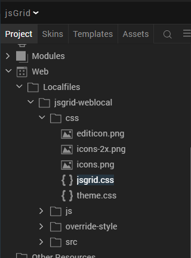
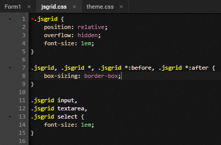

# JSGRID (2.0.1)

# 1. Overview

JSGrid is a JavaScript library that is based on jQuery. The JSGrid component
integrates JSGrid with VoltMX Iris so that you can add data grids to your
existing web apps.

You can use custom back-end data sources to display the data on the component.
You can also modify the UI elements based on your preference. You can use this
component in your web apps to display data from your back-end source as a data
grid/ you can use static data.

## A. Use case

JSGrid is a lightweight client-side data grid control based on jQuery. It supports basic grid operations like inserting, filtering, editing, deleting, paging, and sorting. JSGrid is flexible and allows to customize its appearance and components.

## B. Percentage of re-use:

Approximately 80% reusable.

## C. Features.

-   Provides controls to customize the UI

-   JSGrid is flexible and allows to customize its appearance and components.

-   Allows user to perform basic grid operations like insert, edit, delete,
    search paging and sorting.

# 2. GETTING STARTED

## A. Prerequisite

Before you start using the JSGrid component, ensure the following:

• [HCL Foundry](https://manage.hclvoltmx.com/)

• Volt MX Iris

## B. Platforms Supported

i. PWA & Responsive Web

## C. Importing the app

You can import the Forge components only into the apps that are of the Reference
Architecture type.

**To import the JSGrid component, do the following:**

1. Open your app project in Volt MX Iris..

2. In the Project Explorer, click the **Templates** tab.

3.Right-click **Components**, and then select **Import Component**. The **Import Component** dialog box appears.

4. Click **Browse** to navigate to the location of the component, select the component, and then click **Import**. The component and its associated widgets and modules are added to your project.

Once you have imported a component to your project, you can easily add the
component to a form. For more information, refer Add a Component to a Form

## D. Building and previewing the app

After performing all the above steps, you can build your app and run .For more
information, you can refer to the [Building and Viewing an
Application](https://opensource.hcltechsw.com/volt-mx-docs/docs/documentation/Iris/iris_user_guide/Content/Cloud_Build_in_VoltMX_Iris.html#cloud)
section of the Volt MX User Guide.

You can then run your app to see the JsGrid work in real time

## E. Modifying UI of the grid.

You can edit the CSS of the grid to modify the UI of the grid. To access the CSS
file, follow the given steps.

1. In the **Project** explorer, navigate to **Web** → **Localfiles** → **jsgrid-weblocal** → **css**.

2. From the **css** folder, select either **jsgrid.css** or **theme.css** to open the file. 

3. Use the text editor to edit the css based on your preference. 

# 3. References

## A. Dynamic Usage

If you want to use the JSGrid component dynamically, you will need to import the
component into your project Templates. Follow the given steps to do so

i. Download the component from HCL VoltMX Marketplace as a zip file.

ii. Go to the Templates tab in your project explorer.

iii. Right click on Components and select Import Component.

iv. Navigate to where you downloaded your zip file and import it into Iris.

After you import the component into your project templates, you can add it to
your app dynamically. To do so, follow the given steps

i. Access the FormController of the form you want to add the component into.

ii. Create a function called createComponent(); and write the code inside it to create and configure the component.

iii. You can refer to the given sample code for more information.

	/\* Creating Action Sheet component instance \*/

	createComponent:function(){

	var jsGridInstance= new com.voltmx.jsGrid ({

	"clipBounds": true,

	"height": "100%",

	"id": "jsGrid",

	"isVisible": true,
	
	"left": "0dp",

	"top": "0dp",

	"width": "100%",

	"zIndex":"1"

	}, {}, {

	});

	jsGridInstance.feildSorting=true;

	jsGridInstance.sampleData=true;

	jsGridInstance.heading=true;

	jsGridInstance.filtering=true;

	jsGridInstance.inserting=true;

	jsGridInstance.deleting=true;

	jsGridInstance.paging=true;

	jsGridInstance.editing=true;

	jsGridInstance.pageNextText="Next";

	jsGridInstance.pagePrevText="Prev";

	jsGridInstance.pageFirstText="First";

	jsGridInstance.pageLastText="Last";

	jsGridInstance.gridWidth="100%";

	jsGridInstance.gridHeight="100%";

	jsGridInstance.PageSize=10;

	jsGridInstance.deleteConfirm="Are you sure ?";

	jsGridInstance.invalidMessage="Invalid Data !";

	jsGridInstance.loadMessage="Please, wait !";

	jsGridInstance.noDataContent="There is not data to display";

	this.view.add(jsGridInstance);

	this.view.jsGrid.onItemDeletion = function(args)

	{

	alert("Item Deleted: "+JSON.stringify(args));

	}.bind(this);

	this.view.jsGrid.onItemInsertion = function(args)

	{

	alert("Item Added: "+JSON.stringify(args));

	}.bind(this);

	this.view.jsGrid.onItemUpdation = function(args)

	{

	alert("Item updated: "+JSON.stringify(args));

	}.bind(this);

	this.view.jsGrid.onErrorCallback = function(args)

	{

	alert("Error: "+JSON.stringify(args));

	}.bind(this);
	
	},

## B. Properties

You can use a component's **Properties** to customize and configure the
elements. These elements can be UI elements, service parameters, and so on. You
can set the properties from the Visualizer's Properties panel on the right-hand
side. You can also configure these properties using a JavaScript code.

### i. General

**1. Heading**

| <!-- -->    | <!-- -->    |
|-------------|-------------|
| **Description :**  | Toggles the visibility of the headers
| **Syntax :**  | heading
| **Type :** | Boolean
| **Write/Read :**  | write
| **Default Value :**  | true
| **Example :**  | this.view.jsGrid.heading=true;

**2. Filtering**

| <!-- -->    | <!-- -->    |
|-------------|-------------|
|**Description :** | Toggles the visibility of the filter entries option.
|**Syntax :**  |  filtering
|**Type :**  |  Boolean
|**Write/Read :**  |  write
|**Default Value :** | true
|**Example :**  | this.view.jsGrid.filtering=true;

**3. Insertion**

| <!-- -->    | <!-- -->    |
|-------------|-------------|
|**Description :**  | Toggles the visibility of add entries option
|**Syntax :**  | inserting
|**Type :**  |  Boolean
|**Write/Read :**  |  write
|**Default Value :**  | true
|**Example :**  | this.view.jsGrid.inserting=true;

**4. Editing**

| <!-- -->    | <!-- -->    |
|-------------|-------------|
|**Description :** | Toggles the visibility of the edit entries option.
|**Syntax :**  | editing
|**Type :**  |  Boolean
|**Write/Read :**  | write
|**Default Value :**  |  true
|**Example :**  | this.view.jsGrid.editing =true;

**5. Sorting**

| <!-- -->    | <!-- -->    |
|-------------|-------------|
|**Description :**  | Toggles the visibility of the sort entries option
|**Syntax :**  | feildSorting
|**Type :**  |  Boolean
|**Write/Read :**  | write
|**Default Value :**  | true
|**Example :**  |  this.view.jsGrid.feildSorting =true;

**6. Deleting**

| <!-- -->    | <!-- -->    |
|-------------|-------------|
|**Description :**  |  Toggles the visibility of the delete entries option
|**Syntax :**  |  deleting
|**Type :**  |  Boolean
|**Write/Read :** | write
|**Default Value :**  | true
|**Example :**  | this.view.jsGrid.deleting =true;

**7. Paging**

| <!-- -->    		| <!-- -->    |
|-----------------------|-------------|
|**Description :**   	| Toggles the visibility of the headers Specifies whether you   want to display the data in pages.	|
|**Syntax :**		|   paging
|**Type :**  		| Boolean                                                                                                       	|
|**Write/Read :**  	|  write  													|                    										|
|**Default Value :**	|  true													|
|**Example :**   	|   this.view.jsGrid.paging =true;										|

**8. Page Size**

| <!-- -->           | <!-- -->    |
|--------------------|-------------|
|**Description :**   |  Specifies the number of entries that you want to display in   one page.
|**Syntax :**        |   PageSize
|**Type :**          |   Integer
|**Write/Read :**    |  write
|**Default Value :** |  10
|**Example :**       |  this.view.jsGrid.PageSize =true;

**9. Page Next Text**

| <!-- -->            | <!-- -->    |
|---------------------|-------------|
|**Description :**    | Specifies the text that you want to display to open the next    page of data.
|**Syntax :**         | pageNextText
|**Type :**           |  String
|**Write/Read :**     | write
|**Default Value :**  |  Next
|**Example :**        |  this.view.jsGrid.pageNextText ="Next";

**10. Page Prev Text**

| <!-- -->            | <!-- -->    |
|---------------------|-------------|
|**Description :**    |  Specifies the text that you want to display to open the   previous page
|**Syntax :**         |  pagePrevText
|**Type :**           | String
|**Write/Read :**     | write
|**Default Value :**  | Prev
|**Example :**        |  this.view.jsGrid.pagePrevText ="Prev";

**11. Page First Text**

| <!-- -->            | <!-- -->    |
|---------------------|-------------|
|**Description :**    |  Specifies the text that you want to display to open the first   page of data.
|**Syntax :**         | pageFirstText
|**Type :**           |   String
|**Write/Read :**     | write
|**Default Value :**  |  First
|**Example :**        | this.view.jsGrid.pageFirstText="First";

**12. Page Last Text**

| <!-- -->            | <!-- -->    |
|---------------------|-------------|
|**Description :**    |  Specifies the text that you want to display to open the first   page of data.
|**Syntax :**         |  pageLastText
|**Type :**           |  String
|**Write/Read :**     |  write
|**Default Value :**  | Last
|**Example :**        |  this.view.jsGrid.pageLastText="Last";

**13. Width**

| <!-- -->    | <!-- -->    |
|-------------|-------------|
|**Description :**  |  Specifies the width that you want to set for the grid.
|**Syntax :**   |  gridWidth
|**Type :**  |   String
|**Write/Read :**  |  write
|**Default Value :**  |  100%
|**Example :**  |   this.view.jsGrid.gridWidth= "100%";

**14. Height**

| <!-- -->    | <!-- -->    |
|-------------|-------------|
|**Description :**  |  Specifies the width that you want to set for the grid.
|**Syntax :**  |   gridHeight
|**Type :**  |  String
|**Write/Read :**  |  write
|**Default Value :**  |  100%
|**Example :**  | this.view.jsGrid. gridHeight = "100%";

**15. Sample Data**

| <!-- -->    | <!-- -->    |
|-------------|-------------|
|**Description :**  | Specifies whether you want to display sample data on the   grid.
|**Syntax :**  |   sampleData
|**Type :**  |   Boolean
|**Write/Read :**  | write
|**Default Value :**  | true
|**Example :**  |  this.view.jsGrid.sampleData =true;

 ii. Messages

**1. Load Message**

| <!-- -->    | <!-- -->    |
|-------------|-------------|
|**Description :**  | Specifies the message that you want to display while the   component loads the data.
|**Syntax :**  |  loadMessage
|**Type :**  |  string
|**Write/Read :**  |  write
|**Example :**  |  this.view.jsGrid.loadMessage="Please, wait !"

**2. Delete confirm**

| <!-- -->    | <!-- -->    |
|-------------|-------------|
|**Description :**  |  Specifies the message that you want to display to confirm a   delete operation.
|**Syntax :**  |  deleteConfirm
|**Type :**  |   string
|**Write/Read :**  | write
|**Example :**  |  this.view.jsGrid.deleteConfirm= "Are you sure ?";

**3. Invalid Message**

| <!-- -->          | <!-- -->    |
|-------------------|-------------|
|**Description :**  |  Specifies the message that you want to display when the user   enters invalid data.
|**Syntax :**       |  invalidMessage
|**Type :**         | string
|**Write/Read :**   |  write
|**Example :**      | this.view.jsGrid.invalidMessage= "Invalid Data !";

**4. No Data Content**

| <!-- -->    | <!-- -->    |
|-------------|-------------|
|**Description :**  |  Specifies the message that you want to display when the data   array is empty.
|**Syntax :**  | noDataContent
|**Type :**  |  string
|**Write/Read :**  |  write
|**Example :**  |  this.view.jsGrid.noDataContent= " There is not data to display”,

## C. Events

**i. onItemDeletion**

| <!-- -->          | <!-- -->    |
|-------------------|-------------|
|**Description :**  |  Invoked when the user deletes an item from the grid.
|**Syntax :**  |  onItemDeletion
|**Parameters :**  | *args [Array of JSON]* : The item that the user deleted from   the grid.
|**Example :**  |  this.view.jsGrid.onItemDeletion = function(args)   {   alert("Item Deleted: "+JSON.stringify(args));   }.bind(this); 
   |

**ii.onItemInsertion**

| <!-- -->    | <!-- -->    |
|-------------|-------------|
|**Description :**  |  Invoked when the user insert an item in to the grid.
|**Syntax :**  | onItemInsertion
|**Parameters :**   | *args [Array of JSON]* : The item that the user added in the   grid.
|**Example :**  | this.view.jsGrid.onItemInsertion = function(args)   {   alert("Item Added: "+JSON.stringify(args));   }.bind(this);

**iii. onItemUpdation**

| <!-- -->    | <!-- -->    |
|-------------|-------------|
|**Description :**  | Invoked when the user updates an item in the grid.
|**Syntax :**  |  onItemUpdation
|**Parameters :**  | *args [Array of JSON]* : The item that the user updated in the   grid.
|**Example :**  |this.view.jsGrid.onItemUpdation = function(args)   {   alert("Item updated: "+JSON.stringify(args));   }.bind(this);

**iv. onErrorCallback**

| <!-- -->    | <!-- -->    |
|-------------|-------------|
|**Description :**  |  Invoked when error occurs.
|**Syntax :**  |  onErrorCallback
|**Parameters :**  | *args [Array of JSON]* : Contains information about the error.
|**Example :**  | this.view.jsGrid.onErrorCallback= function(args)   {   alert("Error: "+JSON.stringify(args));   }.bind(this);

## D. API’s

i. setData

| <!-- -->    | <!-- -->    |
|-------------|-------------|
|**Description :**|  Adds the given data to the grid.
|**Syntax :** | setData(header,data)
|**Parameters :**|  header [Array of Strings] :A set of words that you want to    display as the headers of the grid.   data [Array of JSON] :A set of JSON objects that contain the column name and the   data that you want to enter into the grid.
|**Return Value :**| None
**Example :**  var header =
[{

name: "Name",

type: "text",

validate: "required",

width: 100

}, {

name: "Salary",

type: "number",

validate: "required",

width: 50

}, {

name: "Age",

type: "number",

validate: "required",

width: 30

}, {

type: "control",

editButton: true,

deleteButton: true,

clearFilterButton: true,

inserting: true,

filtering: true,

editing: true,

sorting: true,

}, ];

var data =

[

{

"Name": "John",

"Salary": "54000",

"Age": "34"

},

{

"Name": "Kevin",

"Salary": "65909",

"Age": "34"

},

{

"Name": "Steven",

"Salary": "65909",

"Age": "34"

}

];

this.view.jsGrid.setData(header, data);

# 4. Revision History

App version 2.0.1:

## A.Known Issues

NA

## B. Limitations

NA
