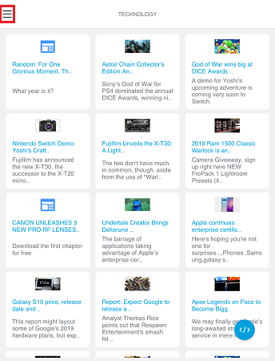
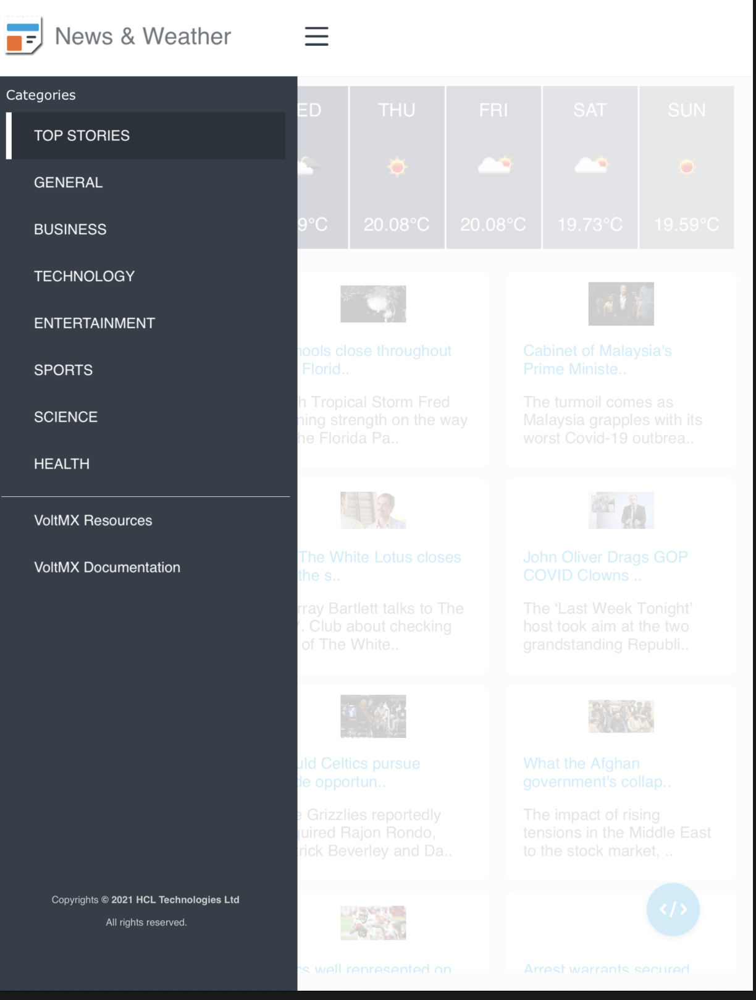

# **News and Weather(2.0.1)**

## **1. Overview :**

The News and Weather omni channel app enables a user to browse through news
headlines with different categories such as ‘Top Stories’, ‘World’, ‘Science’,
‘Technology’, and ‘Sports’, etc. The news items in the app are powered by
"NewsAPI.org". Apart from that, the app lets the user glance through local
weather conditions. Also, it comes with an in-built learning module, Knowledge
Framework, with overview and tutorials for Integration and Orchestration
services.  
The **News and Weather** app allows users to browse through news headlines for
different categories such as Top Stories, General, Business, Technology,
Entertainment, and so on. Furthermore, the app lets users glance through the
news and weather conditions. The app makes use of
[Integration](https://opensource.hcltechsw.com/volt-mx-docs/docs/documentation/Foundry/voltmx_foundry_user_guide/Content/Services.html)
and
[Orchestration](https://opensource.hcltechsw.com/volt-mx-docs/docs/documentation/Foundry/voltmx_foundry_user_guide/Content/Orchestration.html)
services of Volt MX Foundry to fetch data from third-party APIs, and then
populates the data to the front end of the app.

For information on how to import the News and Weather app to Volt MX Iris and
run the app, visit the [Getting
Started](https://marketplace.hclvoltmx.com/items/news-and-weather) page.

### **A. Features**

-   Easy Setup: Import the app and run, you should be ready to launch the app
    after updating your personal api keys for the weather and news backends.  
    To obtain API keys, sign up for a free license at:  
    <https://newsapi.org> and <https://openweathermap.org> and update the keys
    in the Foundry App. Alternatively, you can change the APIs to point at your
    preferred backend as well.

-   Explore News items and get to know about weather conditions

-   Comes integrated with Knowledge Framework which showcases the ‘What’s and
    ‘How’s of the app features

-   Learn about Integration and Orchestration Service capabilities of Volt MX
    Foundry

### **B. App Functionality :**

The News and Weather app is an omni-channel application. This section explains
the functionality of the News and Weather app in Mobile, Tablet, and Desktop Web
platforms.

## 2.  **Getting Started**

### A. Prerequisite

 Before you start using the News and Weather App, ensure you have the following:

-   Volt MX Iris

-   [Volt MX Foundry](https://manage.hclvoltmx.com/)

### B. Platforms Supported

i. Mobile

	1. iOS

	2. Android

ii. Tablets

iii. PWA

### **Latest Updates:**

-   Available in Mobile, Desktop, and tablet channels

-   Responsive web output for desktop app

-   Desktop web UI generated using sketch plugin

## **Mobile Application :**

In the mobile channel, the landing page of the News and Weather app is the
**News and Weather** screen.

The News and Weather screen displays news headlines as well as a category bar
that showcases various categories of news, such as Top Stories, General,
Business, Technology, Entertainment, and so on. You can select any news category
tab to read the news headlines associated with it. By default, the News and
Weather screen displays the **Top Stories** category.

The Top Stories category illustrates the important news headlines and also
provides information on the weather, based on your location. You can click on
any news headline that is displayed on the screen to open the news article
associated with it. The weather details constitute information such as the
current temperature and the predicted temperature for the next few days.

The News and Weather screen also contains a hamburger menu. The hamburger menu
contains details about Volt MX Resources and Volt MX Iris Documentation. To open
the hamburger menu, click on the hamburger menu icon at the upper-left corner of
the screen.

## **Tablet Application :**

In the Android Tablet channel, the landing page of the News and Weather app is
the **News and Weather** screen.

The News and Weather screen showcases all the headlines along with a list of
news categories. By default, the News and Weather screen showcases the **Top
Stories** category. The Top Stories category illustrates important news
headlines and also displays information on the weather, based on your location.
The weather details comprise of information such as the current temperature and
the predicted temperature for the next few days.

The news headlines are arranged in a card format. You can select any news item
(card) to open the news article associated with it. When you click any news
item, the app opens a window that showcases the news article. If you want to
view the news article in your browser, click **Open in Browser**.

You can browse through the categories to read different kinds of news stories
such as General, Business, Technology, Entertainment, and so on. When you select
any category from the list, the respective headlines associated with the news
category is displayed.

**Note**: In tablet devices, when the device orientation is set to Landscape
mode, the menu is visible by default. When the device orientation changes to
Portrait mode, the entire menu collapses into an icon. To view the menu while
the device is in Portrait mode, click on the menu icon.

## 

## 

## **Desktop Web Application :**

In the Desktop Web channel, the landing page of the News and Weather app is the
**News and Weather** screen.

The News and Weather screen displays news headlines belonging to various
categories such as Top Stories, General, Business, Technology, Entertainment,
and so on. The news categories are displayed at the top of the screen near the
title bar. By default, the News and Weather screen showcases the **Top Stories**
category. The Top Stories category illustrates important news headlines and also
provides you information on the weather, based on your location. You can browse
through the category list at the top and click on any particular news category
to load the content related to that category.

The weather details comprise of information such as the current temperature and
the predicted temperature for the next few days.

The news headlines are arranged in a card format. You can click on any news item
(card) present on the screen to open the news article associated with it. When
you click the news item, the app navigates to the respective news article page
on your desktop browser.

Click on the menu icon at the upper-right corner of the screen to find links to
Volt MX Resources and Volt MX Iris Documentation.

The News and Weather app is **responsive** in nature. As you shrink the screen
size, the cards present on the canvas arrange themselves according to the screen
size. All the news categories collapse into a menu list format with a menu icon.
Once you shrink the screen size to a particular size, the menu icon appears.
Click the menu icon to open the menu containing all the news categories.

## **Import the App**

To import the News and Weather app into your workspace, follow these steps:

1.  Open Volt MX Iris

2.  On the main menu select **Forge** → **Browse**.

3.  Search for the News and Weather app, and then click **Import to Workspace**.
    The app is imported to your workspace.  
    A dialog box appears, confirming that the app has been imported. Click
    **OK**.

4.  Switch to your project containing the News and Weather app. To switch to
    your project, click **File** → **Open** → **Reference Architecture** →
    **\<project name\>**

## **Live Preview**

After importing the News and Weather app, you can preview the app on any channel
by using **Live Preview**.

**Note**: To preview the app on your mobile or tablet device, ensure that you
install the latest version of the Volt MX Iris App Viewer app on your mobile or
tablet device from the App Store or from Google Play.

To preview the app by using Live Preview, follow these steps:

1.  In Volt MX Iris Starter, click **Build** → **Live Preview Settings** from
    the main menu. The **Live Preview Settings** window opens.
    
    **Note**: In Volt MX Iris Enterprise, click **Preview** → **Run** from the
    main menu to open the **Live Preview Settings** window.

2.  Select any application channel such as Mobile Native, Tablet Native, or
    Responsive Web along with the respective platform(s) on which you want to
    preview the app. Click **Save & Run**.

After a successful preview build for Mobile and Tablet channels, a window
appears containing a QR code. You can scan this QR code from the Volt MX Iris
App Viewer application on your mobile or tablet device to preview the app.

For more information on Volt MX Iris App Viewer, you can refer the [Volt MX Iris
App Viewer
Documentation](https://opensource.hcltechsw.com/volt-mx-docs/docs/documentation/).

After a successful preview build for the Desktop Web channel, the **Iris
Preview** window opens displaying the News and Weather Desktop Web application.

## **News and Weather Volt MX Foundry Services:**

The News and Weather app contains an **Integration Service** :

-   **NewsSampleService:** This service is used to retrieving live articles from
all over the web.

    Operations :

      i.  CategorizedNews - Used to get different categories of news

      ii.  TopStories - Used to get the top headlines of a news

-   **WeatherSampleService**

    Operations :

      i.  WeatherForecast – Used to get the weather temperature

-   **LocationSampleService**

    Operations :

      i.  LocationService – Used to get the current location

    And an **Orchestration Service** :

-   Top Stories and Weather – Used to get both top headlines and Weather

-   Weather and Location – Used to get both Weather and current location

### **Limitations :**

-   Landscape mode is not available for all devices.

-   If browser height is minimized then UI might get distorted.
