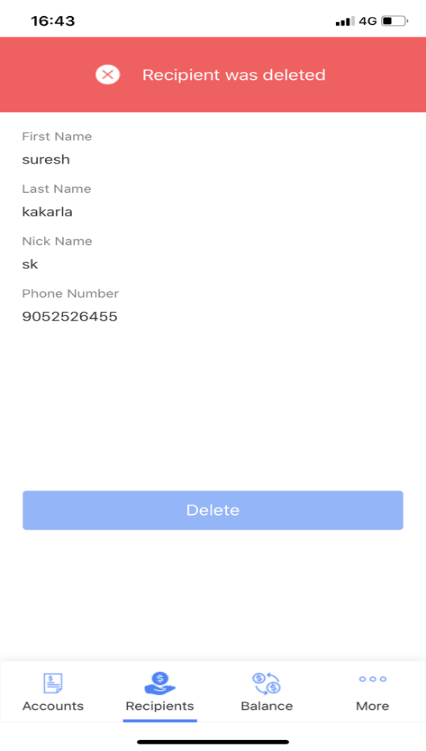

# **Recipients Mobile App**

## **Asset Version:** 1.0.1

## **Overview:**

The Recipients App is an easily preview of a basic Banking application. The app
offers configurable lists for accounts and recipients, and detail views for each
recipient, with configured identity and object services.

**Prerequisite –** VoltMX Iris, VoltMX Foundry, VoltMX App Viewer.

**Devices:** Mobile

**Platforms:** Android, iOS

**Live preview the asset using App Viewer:**

**App Preview Code:** 4IGXJ

**Scan with App Viewer:**

**Login Credentials for login into the app:** test1@test.com/Test@999

**Features:**

-   User Repository

-   CRUD functionality

**The app has the following entities:**

**Login:** Contains key front-end capabilities typically used in a mobile or web
app's login page. This screen has a configured connectivity to a User
Repository.

**Accounts:** A list of different accounts present in the User's profile,
displays the name of the account along with the Balance in each account. This
screen has a configured connectivity to a Storage Object service.

**Recipients:** A list of Recipients that the user has added/associated to the
profile, displays the names of the recipients along with their phone numbers.
This screen has a configured connectivity to a Storage Object service. In the
Recipients screen, users also have an option to Add a recipient.

**Add Recipient:** A screen where new recipient can be added.

**Recipient Details:** A single screen detail view of the recipient details,
displays all the data specific to a recipient. From the Recipient Details
screen, users can edit the details of the recipient or delete the recipient.

**Delete Recipient:** User can delete the recipient by clicking on delete button
in recipient details screen.

**Edit Recipient:** In this screen user can edit/update the recipient details.

**Import the App**

To import the Recipients app into your workspace, follow these steps:

1.  Open Volt MX Iris

2.  On the main menu select **Forge** → **Browse**.

3.  Search for the Recipients app, and then click **Import to Workspace**. The
    app is imported to your workspace.  
    A dialog box appears, confirming that the app has been imported. Click
    **OK**.

4.  Switch to your project containing the Recipients app. To switch to your
    project, click **File** → **Open** → **Reference Architecture** →
    **\<project name\>**

## **Live Preview**

After importing the Recipients app, you can preview the app on any channel by
using **Live Preview**.

**Note**: To preview the app on your mobile, ensure that you install the latest
version of the Volt MX Iris App Viewer app on your mobile device from the App
Store or from Google Play.

To preview the app by using Live Preview, follow these steps:

1.  In Volt MX Iris Starter, click **Build** → **Live Preview Settings** from
    the main menu. The **Live Preview Settings** window opens.

**Note**: In Volt MX Iris Enterprise, click **Preview** → **Run** from the
    main menu to open the **Live Preview Settings** window.

2.  Select any application channel such as Mobile Native along with the
    respective platform(s) on which you want to preview the app. Click **Save &
    Run**.

After a successful preview build for Mobile channels, a window appears
containing a QR code. You can scan this QR code from the Volt MX Iris App Viewer
application on your mobile device to preview the app.

For more information on Volt MX Iris App Viewer, you can refer the [Volt MX Iris
App Viewer
Documentation](https://opensource.hcltechsw.com/volt-mx-docs/docs/documentation/).

**Recipients Volt MX Foundry Services:**

1\. The Recipient Mobile app contains an **Identity Service**:

Uses **User Repository** identity for to login into the app.

2\. Recipients Mobile App Contains **Object Services:**

-   **Account Storage**: By using data storage object service fetching
    Recipients account Details Such as name of the account along with the
    Balance in each account.

**Operations:**

-   GET: Used to get the account details of Recipients

Account Storage data model contains below fields.

-   **Recipients Storage**: By using data storage object service fetching
    Recipients Details Such as names of the recipients along with their phone
    numbers. And we can perform crud operation add, edit & delete
    functionalities.

**Operations:**

-   GET: Used to get the Recipients details.

-   PUT(Update): Used to update the Recipients details.

-   POST(Create): Used to create new Recipient

-   DELETE: Used to delete a Recipient.

Recipients Storage data model contains below fields.

# 

# **Revision History:**

App version: 1.0.1

**Good To Have:**

Max length validations for input fields in Add Recipient & Edit Recipient
screens.

A.  **Known Issue:**

NA

B.  **Limitations:**

Supports only for mobile devices not for tablet and iPad.
