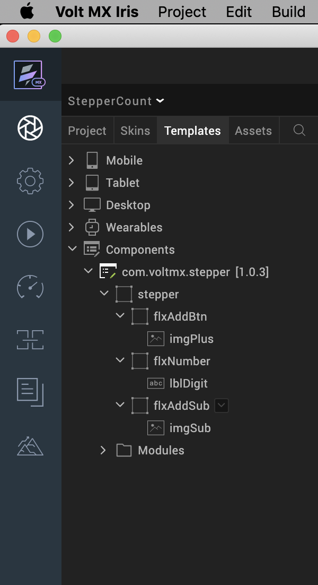

Date : 28-Oct-21

**Stepper** (1.0.3)

1.Overview

The stepper component is a number increment counter. This component provides a
basic stepper template which returns the selected number. It is generally used
to denote order quantity, number of items, etc. This type of component is
generally used in retail, e-commerce and other similar scenarios.

## Use case

### select a number between two limits, such as in a shopping cart or a product catalogue .

## Features

1.  This component provides a basic stepper template which returns the selected
    number.

## Percentage of re-use:

90%

# Getting Started

## Prerequisites

This is a getting started section for the Stepper component. It contains
information about setting up and running your component in an application.

Before you start using the Stepper component, make sure that you meet all the
prerequisites.

-   HCL Foundry

-   Volt MX Iris

## Platforms Supported

### Mobile

#### iOS

#### Android

### Tablets

### PWA

## Importing the Component

## You can import the Forge components only into the apps that are of the Reference Architecture type.

## **To import the Stepper component, do the following:**

## Open your app project in Volt MX Iris.

1.  In the Project Explorer, click the **Templates** tab.

## 

## 

3.Right-click **Components**, and then select **Import Component**. The **Import
Component** dialog box appears.

4.Click **Browse** to navigate to the location of the component, select the
component, and then click **Import**. The component and its associated widgets
and modules are added to your project.

## Once you have imported a component to your project, you can easily add the component to a form. For more information, refer Add a Component to a Form.

## 

## Building and previewing the app

After performing all the above steps, you can build your app and run it on your
device. For more information, you can refer to the [Building and Viewing an
Application](https://opensource.hcltechsw.com/volt-mx-docs/docs/documentation/Iris/iris_user_guide/Content/Cloud_Build_in_VoltMX_Iris.html#cloud)
section of the Volt MX Iris User Guide.

You can then run your app to see the Stepper work in real time.

## 

## 

# References

## Dynamic Usage

If you want to use the Stepper component dynamically, you will need to import
the component into your project **Templates**.

After you import the component into your project templates, you can add it to
your app dynamically. To do so, follow the given steps.

1.  Access the **FormController** of the form you want to add the component
    into.  
    

2.  Create a function called createComponent(); and write the code inside it to
    create and configure the component.  
    You can refer to the given sample code for more information.

    createComponent : function()

    {

    /\* Creating the component's object \*/

    var stepper = new com.voltmx.stepper(

    {

    "clipBounds": true,

    "height": "15%",

    "id": "stepper",

    "isVisible": true,

    "left": "0dp",

    "top": "0dp",

    "width": "15%",

    "zIndex": 1

    }, {}, {});

    /\* Setting the component's properties \*/

    stepper.initialValue = 1;

    stepper.counterStartValue = 1;

    stepper.counterEndValue = 10;

    stepper.incrementValue=1;

    stepper.imagePlusSrc = "voltmx_sc_plus.png";

    stepper.imageSubSrc = "voltmx_sc_minus.png";

    /\* Adding the component to a form \*/

    this.view.add(stepper);

    var count = stepper.getStepperValue();

    alert("Counter Value: "+count);

    }

Now, you will need to call this function using **Actions**. For more
information, refer to the [Add
Actions](https://opensource.hcltechsw.com/volt-mx-docs/docs/tutorials/ActionEditor.html)
section of the Volt MX Iris User Guide.

## Properties

You can use **Properties** to customize and configure the elements of a
component. These elements can be UI elements, service parameters, and so on. For
more information about properties, you can refer to the [Components
Overview](https://opensource.hcltechsw.com/volt-mx-docs/docs/documentation/Iris/iris_user_guide/Content/C_ComponentsOverview.html)
section of the Volt MX Iris User Guide.

You can set the properties from the Properties panel on the right hand side of
the Volt MX Iris. You can also configure these properties using a JavaScript
code.

**General**

**1. Initial Value(initialValue)**

| **Description:**   | Specifies the value that you want to display on the [counter](javascript:void(0);). |
|--------------------|-------------------------------------------------------------------------------------|
| **Syntax:**        | initialValue                                                                        |
| **Type:**          | Number                                                                              |
| **Read/Write:**    | Read + Write                                                                        |
| **Default Value:** | 1                                                                                   |
| **Example:**       | this.view.componentID.initialValue = 1;                                             |

**2.** [**Min Value**](javascript:void(0);)**(counterStartValue)**

| **Description:**   | Specifies the minimum value that you want to allow on the [counter](javascript:void(0);).                                                |
|--------------------|------------------------------------------------------------------------------------------------------------------------------------------|
| **Syntax:**        | counterStartValue                                                                                                                        |
| **Type:**          | Integer                                                                                                                                  |
| **Read/Write:**    | Read + Write                                                                                                                             |
| **Default Value:** | 1                                                                                                                                        |
| **Remarks:**       | Make sure that you set a value that is lesser than the [Max Value](https://docs.kony.com/marketplace/stepper/Content/Reference.htm#Max). |
| **Example:**       | this.view.componentID.counterStartValue = 0;                                                                                             |

**3.**[**Max Value**](javascript:void(0);)**(counterEndValue)**

| **Description:**   | Specifies the maximum value that you want to allow on the [counter](javascript:void(0);).                                                 |
|--------------------|-------------------------------------------------------------------------------------------------------------------------------------------|
| **Syntax:**        | counterEndValue                                                                                                                           |
| **Type:**          | Integer                                                                                                                                   |
| **Read/Write:**    | Read + Write                                                                                                                              |
| **Default Value:** | 10                                                                                                                                        |
| **Remarks:**       | Make sure that you set a value that is greater than the [Min Value](https://docs.kony.com/marketplace/stepper/Content/Reference.htm#Min). |
| **Example:**       | this.view.componentID.counterEndValue = 10;                                                                                               |

**4. Increment Value (incrementValue)**

| **Description:**   | Specifies the maximum value that you want to allow on the [counter](javascript:void(0);).                                                 |
|--------------------|-------------------------------------------------------------------------------------------------------------------------------------------|
| **Syntax:**        | incrementValue                                                                                                                            |
| **Type:**          | Integer                                                                                                                                   |
| **Read/Write:**    | Read + Write                                                                                                                              |
| **Default Value:** | 1                                                                                                                                         |
| **Remarks:**       | Make sure that you set a value that is greater than the [Min Value](https://docs.kony.com/marketplace/stepper/Content/Reference.htm#Min). |
| **Example:**       | this.view.componentID.incrementValue= 10;                                                                                                 |

**5. Plus Button(imgPlusSrc)**

| **Description:**   | Specifies the source of the image that you want to display on the [plus button](javascript:void(0);). |
|--------------------|-------------------------------------------------------------------------------------------------------|
| **Syntax:**        | imgPlusSrc                                                                                            |
| **Type:**          | List Selector String                                                                                  |
| **Read/Write:**    | Read + Write                                                                                          |
| **Default Value:** | "voltmx_sc_plus.png"                                                                                  |
| **Remarks:**       | Make sure that the image that you want to use exists in the *Resources* folder of your workspace.     |
| **Example:**       | this.view.componentID.imgPlusSrc = "plus.png";                                                        |

**6. Minus Button(imgSubSrc)**

| **Description:**   | Specifies the source of the image that you want to display on the [minus button](javascript:void(0);). |
|--------------------|--------------------------------------------------------------------------------------------------------|
| **Syntax:**        | imgSubSrc                                                                                              |
| **Type:**          | List Selector String                                                                                   |
| **Read/Write:**    | Read + Write                                                                                           |
| **Default Value:** | "voltmx_sc_minus.png"                                                                                  |
| **Remarks:**       | Make sure that the image that you want to use exists in the *Resources* folder of your workspace.      |
| **Example:**       | this.view.componentID. imgSubSrc = "minus.png";                                                        |

## **Skins**

Skins define the appearance of a widget. You can apply and manipulate skins
based on your preference. For more information, refer to the [Understanding
Skins and
Themes](https://opensource.hcltechsw.com/volt-mx-docs/docs/documentation/Iris/iris_user_guide/Content/Customizing_the_Look_and_Feel_with_Skins.html)
section of the Volt MX Iris User Guide.

**Note:**  
Make sure that the skins that you assign to a **widget** are of the same
**widget type**.

7\. Flex Number Skin(flxNumberSkin)

| **Description:** | This skin links to the background of the [counter](javascript:void(0);).                                                                  |
|------------------|-------------------------------------------------------------------------------------------------------------------------------------------|
| **Syntax:**      | flxNumberSkin                                                                                                                             |
| **Widget Type:** | [Flex Container](https://opensource.hcltechsw.com/volt-mx-docs/docs/documentation/Iris/iris_widget_prog_guide/Content/FlexContainer.html) |
| **Example:**     | this.view.componentID.flxNumberSkin = " voltmxstpsknFlx78a8f0BG";                                                                         |

8\. Label Digit Skin(lblDigitSkin)

| **Description:** | This skin links to the text label of the [counter](javascript:void(0);).                                                 |
|------------------|--------------------------------------------------------------------------------------------------------------------------|
| **Syntax:**      | lblDigitSkin                                                                                                             |
| **Widget Type:** | [Label](https://opensource.hcltechsw.com/volt-mx-docs/docs/documentation/Iris/iris_widget_prog_guide/Content/label.html) |
| **Example:**     | this.view.componentID.lblSkin = " voltmxstpsknLblfffcffFT";                                                              |

## 

## C. Events

\-- None of the events are exposed.

## D. API’s

The following APIs pertain to the Stepper component:

[1.
getStepperValue](javascript:void(0);)

| **Description:**  | Retrieves the current value on the counter.                                          |
|-------------------|--------------------------------------------------------------------------------------|
| **Syntax:**       | getStepperValue()                                                                    |
| **Parameters:**   | None                                                                                 |
| **Return Value:** | *count [String]* : The current value on the counter.                                 |
| **Example:**      | var count = this.view.componentID.getStepperValue(); alert("Counter Value: "+count); |

# Revision History

App version 1.0.3:

## Limitations

1.voltmx.ui.toast works only in Android Platform . So the message(Min and Max
value is reached) will be displayed only in android.

2\. If browser height is minimized then UI gets distorted.
